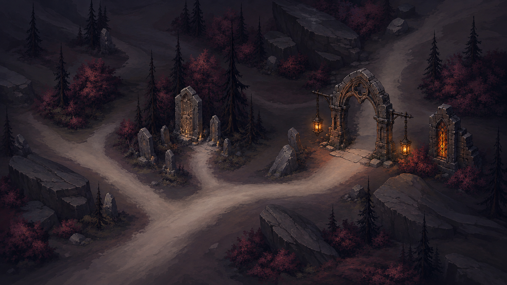
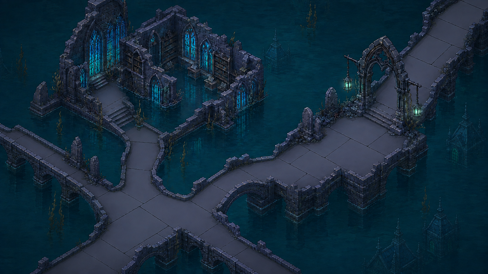
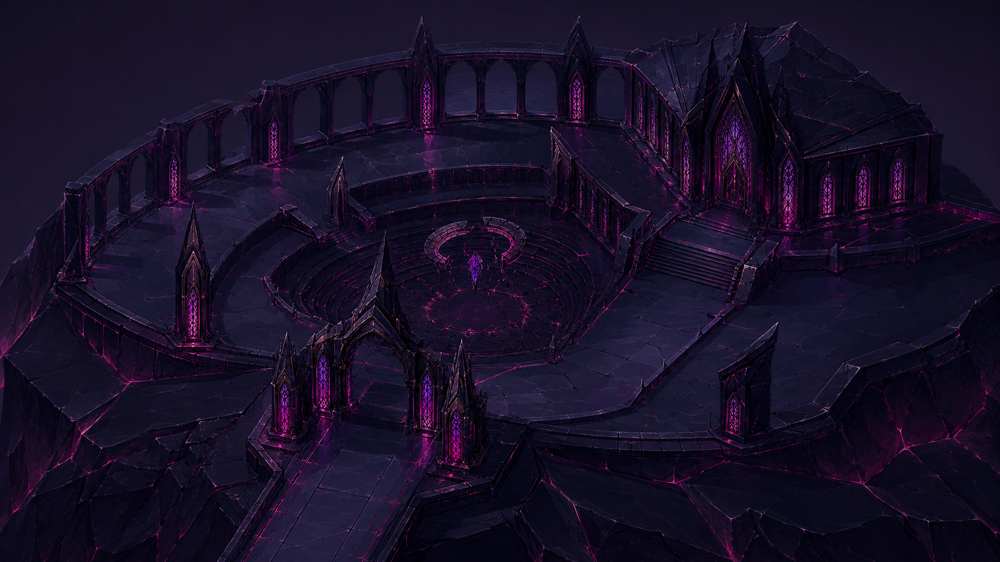
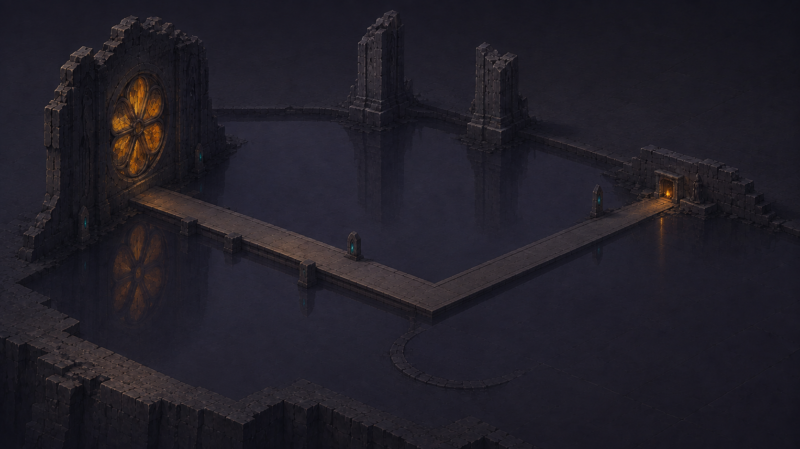

# Chapter art directions — current comparison

Status: all four individual chapter directions and their combined review approved,
including Act III v5 after its architecture, colour and ground revision. These
files are the current review references. Step 1 remains in progress for
game-camera composition and navigation design; implementation has not started.

| Act I — The Ashen Woods | Act II — The Sunken City |
| --- | --- |
|  |  |
| Ash-red woodland, charcoal conifers, amber glass and paired lamps. | Drowned Gothic library, teal water, blue glass and jade light. |

| Act III — The Obsidian Court | Act IV — The Mirrored Road |
| --- | --- |
|  |  |
| Approved: intact faceted obsidian court, sharp Gothic glass and magenta joints; architecture and floor reconsidered against combat. | Approved: monumental remnants enclosing emptiness; grandeur through absence, with an unsettling small hearth. |

## Shared direction

Substantial hand-painted forms, Gothic glass, restrained open-surface detail
and readable route silhouettes connect the set to the existing combat world.
Act III's enclosing architecture and Act IV's sparse surviving structures
deliberately create different emotional experiences. Act IV must remain sad,
dark, grand and empty; it must not return to a furnished multi-room cathedral
or an unstructured plane with scattered props.

## Combined visual review

The agent inspected the current four originals together after James approved
Act III v5. The sequence moves from ash-red woodland and small amber lights,
through cold flooded blue-green masonry, into sharp black-violet obsidian and
magenta light, before returning to sparse amber light within a vast dark mirror
court. Gothic glass, weighty forms and concentrated illumination connect the
chapters; the architectural density peaks in III and releases into IV's emptiness.

Retain these chapter identities for the next composition study. These paintings
use different spatial extents and do not establish a shared gameplay scale.
Act III's darker floor in particular requires route and selection contrast to
be demonstrated in the actual camera study. Do not compensate by adding noisy
ground detail or increasing glow across the entire surface.

## Acceptance boundary

These are mood, material and architectural references with approval status
specified above. They are not
literal graph layouts, runtime screenshots or proof of camera projection,
navigation, five-node Act IV placement, phone readability or performance.
The next Step 1 study must use real generated route density and account for
HUD space, waystone identity, current/available/history states and reference
screen shapes. Complete and agree that brief before autonomous Steps 2–8.
