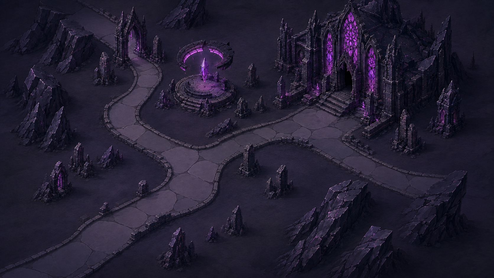
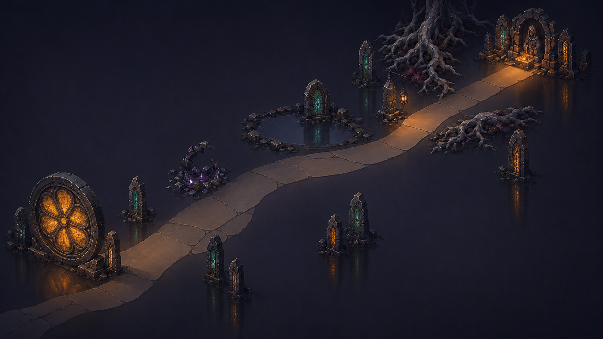

# Four-act concept review

Status: historical comparison. James's combined review reopened Acts III and IV:
the court was monotonous and the final road too flat and sparsely assembled.
The agent's earlier positive judgement below did not meet the owner's standard.
Acts I and II remain approved. New candidates are linked in the rough plan;
Step 1 remains in progress.
Images below are the unaltered concept files, not new generated variants.

| Act I — The Ashen Woods | Act II — The Sunken City |
| --- | --- |
|  |  |
| Ash-red woodland, charcoal conifers, amber glass and paired lanterns. | Flooded Gothic library, teal water, blue glass and jade light. |

| Act III — The Obsidian Court | Act IV — The Mirrored Road |
| --- | --- |
|  |  |
| Angular obsidian courts, violet glass and a broken levitating halo. | Quiet mirror-ground, amber rose window, stelae and returning hearth light. |

## Agent judgement

The set holds together through substantial illustrated masonry, restrained
open surfaces, Gothic glass, localised coloured light and readable roads.
Distinct geography supports chapter recognition independently of colour:
rooted forest, drowned civic architecture, angular ceremonial courts, then
an unbranched road through mirror-space. The colour progression moves from
ash-red and amber through teal and violet, returning to amber in Act IV with
a different emotional context.

Act I retains more organic brushwork; Acts II and III use harder stone forms;
Act IV uses deliberate emptiness and reflections. These differences express
the environments while retaining the shared shape and detail hierarchy.
Combat identity is retained through each chapter's recognisable architecture,
glass, lamps and monuments rather than by copying the combat composition.

The agent found no unresolved concept defect requiring another redraw before
the combined owner review. This is a subjective art-direction judgement, not
an assertion that production visual acceptance has passed.

## Remaining Step 1 work

Agree the combined chapter direction, then produce a representative screen
study with real generated route density, HUD space, waystone symbols and
navigation states at the reference shapes. The current concepts do not prove
touch targets, phone readability, projection, asset footprints, performance,
or compatibility with arbitrary generated layouts. Confirm the resulting
visual brief before starting autonomous Steps 2–8.
