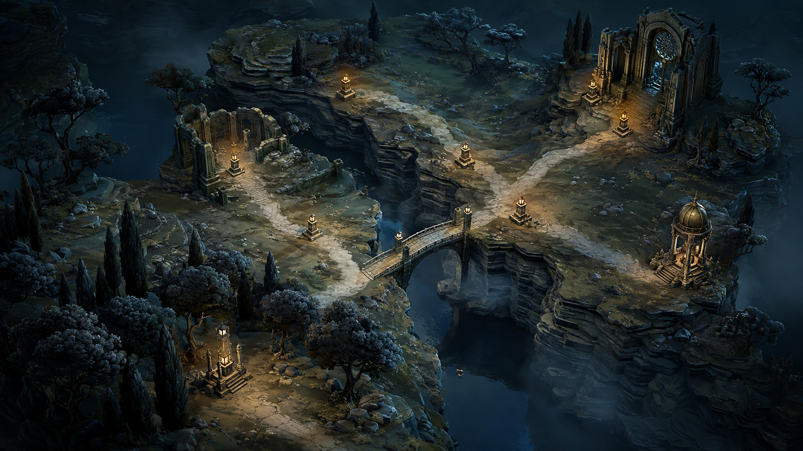

# Map visual renovation — initial rough plan

Status: James has approved the Act I native sample for Step 3 after Review 10,
while explicitly noting that it is not perfect. This clears the agreed owner
checkpoint for progression into Step 4; it is not final commercial acceptance.
Step 1 is also approved, including the four-act direction and Journey / Whole
act composition study. Steps 2–3 produced the native greybox and coherent
asset review sample. The revision history below records how that sample evolved.
James prefers Review 03's fuller woodland and Review 04's roads. He authorised
restoring the earlier vegetation balance with newer forms as occasional accents.
James found the balance better and asked where the new assets were. Review 06
now places all twelve natural forms, retains all 460 main scenery transforms,
and provides six marked native close-ups of the additions. The revised
composition led to a new owner request: focus on unnatural and broken roads,
with freedom to revise their rendering and provide another page. After Review 07,
James identified flat terrain, insufficient bridge clearance and rough bridgeheads.
Review 08 now derives physical terrain elevations from the generated topology,
with rolling woodland, an incised river, dry underpasses and supported arched
bridges. The revised page compares six locations with Review 07 and adds adult
scale references, two lower inspection cameras and a closest-zoom bridgehead.
Mesh contacts, clearance, source-road coverage, navigation framing, native input
exercises and the revised captures are checked. Broader production remains after
this Step 3 discussion; this revision does not close commercial acceptance.
James subsequently asked for the still-visible road/bridge material joint to be
fixed. Review 09 replaces the translucent paving fade with partly buried stone
flags and a shared world-space pattern. It also fixes ground intersections that
centreline contact probes missed, using land-aligned deck tessellation and a
surface height floor. The review starts at the bridgehead and compares 09/08.
James then requested a fully filled river with the best water presentation.
Review 10 raises and confines the water to the channel, adds depth tint,
refraction, a restrained moving sky sheen, shore wash and wakes at five immersed
supports. Two native eight-second films and six 09/10 comparisons form the
new review page. Water coverage, bed alignment, dry routes, loop continuity and
native reference-shape interactions are checked. The remaining delivery plan is
unchanged.

## Goal

Create a cohesive, commercially credible top-down pilgrimage landscape. The
environment must hold together as a place, while generated routes, encounter
states and navigation remain immediately readable. Passing technical checks
does not establish that the visual goal has been achieved.

The previous delivery, [PR #539](https://github.com/fol2/glassvow/pull/539), is a
saved baseline, not an accepted visual target. Asset reuse is optional.

## Agreed collaboration

- James and the agent jointly develop and agree Step 1: the visual brief,
  composition, camera, asset language and acceptance criteria.
- The agent completes Steps 2–3 autonomously and resolves known defects before
  inviting James to inspect the native asset sample. James has now approved
  Act I at this checkpoint. Steps 4–8 proceed autonomously and cover production,
  iteration, visual inspection, integration, validation, independent review,
  PR, CI, merge and cleanup.
- Step 5 is an agent-owned acceptance gate against the agreed brief. It does
  not introduce another routine owner-approval requirement.
- Report meaningful results and actual blockers. Escalate a material departure
  from the agreed direction, an unresolved incompatibility, or an unavailable
  required capability or gate; do not silently weaken acceptance.

### Carry-forward standards and chapter reviews

James authorises applying the lessons from Act I to the remaining chapters.
Their approved concepts remain the art authority; no new concept-approval
round is needed unless the intended direction materially changes.

- Compose substantial landscape and architectural masses first. Asset variety
  must support believable scale, clustering and silhouette; adding more small
  props must not regress the successful density or leave a decorated blank plane.
- Keep open ground crisp and quiet, with broad material planes and local detail.
  Avoid stretched textures, all-over brush noise and blur used to hide repetition.
- Build purposeful relief, grounded approaches and supported bridges. Inspect
  route turns, merges, crossing levels and the whole bridgehead surface, not
  only centreline contacts. Preserve generated nodes and route meaning.
- Integrate water with its banks and structures. Verify depth, waterlines,
  movement and reflections in native footage as well as still images. Adapt
  these effects to the chapter rather than copying the woodland river wholesale.
- Align architecture, floor, materials, palette and lighting with combat.
  Inspect close, default and whole-act views with navigation both visible and
  hidden. Resolve known failures before presenting a candidate to James.

Keep the agreed production order: finish and inspect the common section in
Steps 4–5, then prove its generator rules in Step 6. Extend that foundation
through Act II, III and IV in Step 7. The agent's review format is one coherent
native scene per chapter, followed by a four-act comparison; these are useful
owner feedback opportunities, not additional routine stop-and-wait gates.
The chapter checks focus on the following distinct experiences:

| Chapter | Native scene must establish |
| --- | --- |
| II — The Sunken City | A drowned Gothic library, blue glass, jade light, clear waterlines and dry supported causeways; quiet submerged forms rather than a busy reef. |
| III — The Obsidian Court | An intact, severe obsidian precinct, legible court and hall hierarchy, broad black-violet floors and concentrated magenta light; no return to rubble or grey masonry. |
| IV — The Mirrored Road | Grand, empty, sad and dark space, expressed through structural scale and depth, sparse meaningful monuments and the small unsettling hearth; preserve the fixed journey. |

The combined review checks shared scale, surface restraint, navigation and the
emotional sequence across all four acts. It does not require equal density:
Act III's enclosure and Act IV's emptiness are deliberate differences.

## Concept anchor

### Current review direction

James requested revision of every chapter concept, including the previously
accepted Act I study. Review Acts I–IV individually, then review the complete
set together before closing Step 1. Earlier concept acceptance does not approve
the revised chapter compositions.

Retain the accepted [painterly language](concepts/painterly-language-reference.png):
broad painted colour planes, substantial sculpted forms and restrained detail.
Align chapter architecture, materials, signature lighting and motifs with the
existing combat environments. Density and framing can differ to suit map
navigation. No combat asset changes are approved by this concept review.

Before requesting James's review, the agent must resolve known visual defects
and judge the candidate against the brief. Do not pass an acknowledged defect
to the owner as something to fix later.

Approved: [Act I — combat-aligned study v2](concepts/act1-combat-aligned-v2.png).
James approved this chapter concept. It restores charcoal conifers, ash-red woodland,
paired amber lanterns, a trefoil stone arch and amber stained glass. Ground
texture density was reduced after v1: continuous painted earth replaces the
gravel-like road, with stone detail concentrated at landmarks. The agent visually
checked route continuity, retained landmark detail and chapter identity. It is generated
concept art, not a rendered game scene or generator-derived route layout.

Approved: [Act II — combat-aligned study v3](concepts/act2-combat-aligned-v3.png).
James approved this chapter concept. Gothic blue
glass, jade lanterns, kelp and a flooded library connect the map to the combat
environment. Revisions established visible waterlines and reflections, reduced
submerged detail and replaced fine pavement mottling with broad matte slabs.
This is concept art, not generator or native runtime evidence.

During the combined review James reopened Acts III and IV: Act III's scattered
stones were monotonous; Act IV's flat space and isolated items did not deliver
the final chapter's visual ambition. Earlier individual approvals are retained
as history, but these two compositions are superseded.

Act III spatial direction retained from [court v3](concepts/act3-court-recomposed-v3.png),
but James reopened its ruined condition: the court should remain intact.
James rejected [intact court v4](concepts/act3-intact-court-v4.png) for its
colour, tone, ground and building mismatch with combat; the agent's earlier
concept pass was insufficient. James subsequently approved
[obsidian court v5](concepts/act3-obsidian-court-v5.png).
Its complete hall, entrance and arcade are redesigned around faceted obsidian,
sharp Gothic glass and magenta joints, with calmer broad black-violet floor slabs.
The sunken audience court and raised hall retain spatial hierarchy.
The supernatural halo remains broken as the chapter's story motif.
The interpretation follows the court's refusal to move on in `03-acts.md`;
centuries of waiting do not require collapsed architecture.

Superseded Act IV candidate: [recomposed sanctuary v4](concepts/act4-sanctuary-recomposed-v4.png).
A massive rose-window wall, broken vaults, recessed mirror courts, supported
bridge and rooted cloister enclose the final approach to a modest hearth.
Earlier-act echoes are architectural spaces rather than detached roadside props.
A route-clarity edit removed the front entrance staircase and broke the near
perimeter gallery. Exact single-route gameplay still needs the later layout
study; this concept does not prove it.

James found Act III substantially better, but Act IV too complex. The final
chapter must feel grand, empty, sad and dark. Its earlier flat item display
and the later crowded sanctuary are both unsuitable targets.

James agreed the story-grounded Act IV direction: use the settled truth in
`docs/story/00-truth.md` sections 1, 2.4 and 2.6 and `03-acts.md` Act IV.
The monuments are the walkers; the endpoint is the same hearth seen from its
other side; the final passage ends the arrangement that kept sending another
walker. Warm light must therefore feel familiar and unsettling, rather than
promise uncomplicated comfort. This is an art interpretation, not new canon.
Compose emptiness within a small number of enormous, visibly thick remnants
of one sanctuary: a monumental window wall, a few structural piers and a
broad recessed floor. Scale, absence and long shadows provide grandeur.
Preserve one clear route, sparse meaningful monuments and the small hearth.
Earlier-act echoes should be subordinate marks in the environment, not five
fully furnished rooms. Retain enough relief to avoid another flat prop display.
No new story copy, canon or combat changes are introduced by this proposal.

Approved Act IV concept: [grand, empty sanctuary v6](concepts/act4-grand-empty-v6.png).
James confirmed that this image feels right after agreeing its story direction.
A massive dim rose-window wall, two surviving piers and a small hearth wall
define a largely empty recessed mirror court. One bent causeway connects the
window to the hearth. An edit removed an unintended branch and reduced fine
ground texture. Structural thickness, reflections and the small scale of the
hearth provide the intended mournful grandeur. This is a mood/composition study;
it does not establish the five gameplay stops or runtime navigation acceptance.

The [current chapter comparison](concepts/approved-chapter-directions.md) contains
approved Act I v2, Act II v3, obsidian Act III v5 and grand-empty Act IV v6.
All four individual directions are approved; Act III's earlier
spatial composition remains the reference, but its ruined condition does not. The
[earlier combined review](concepts/four-act-review.md) records the set that
prompted this correction. The subsequent accepted camera-composition study closed Step 1.
The Act I native asset sample has passed the agreed Step 3 owner checkpoint.
The earlier triptych is a superseded
discussion study, not the approved chapter direction.

### Preserved earlier anchor

James accepted the recommendation to retain the existing concept's world feel
and redesign its composition for the actual game camera and route density.

This is concept art, not runtime evidence. Its useful qualities are substantial
landforms, integrated roads and architecture, coherent cool ambient light,
restrained warm accents and recognisable landmarks. Its idealised composition
does not prove phone readability or compatibility with generated layouts.

## Step 1 — joint visual brief

### Agreed camera experience

James agreed: experience the journey at close range by default, then zoom out
to plan the wider route. This settles the intended experience, not the exact
camera tilt, zoom distances or visible node count. Those remain subject to
composition studies with real generated routes and the reference screen shapes.
James subsequently accepted composition study 01 and authorised progression.
Steps 2–3 proceeded autonomously under this brief, with James joining at
the end of Step 3 before Step 4.

The choices below are implementation starting points governed by the accepted
experience. Exact geometry and exposure remain adjustable through native proof.

| Decision | Starting proposal | Evidence needed for agreement |
| --- | --- | --- |
| Camera and composition | Agreed experience: close journey view by default, with zooming out for route planning. Proposed framing: current position towards the left, room for upcoming choices and a dominant landmark. | Resolve exact framing using actual screen compositions with representative generated node density and HUD space. |
| Terrain and roads | Convincing land relief, fractured banks, supported bridges and worn roads which belong to the landscape. | A composition study showing how those forms coexist with branches, merges and clear navigation. |
| Asset language | Lit 3D for major terrain, architecture and near scenery; selective 2D where it remains convincing. | One consistent reference for proportions, surface detail, grounding and shadows. |
| Light and colour | Cool ambient light with deliberate warm accents; retain midtone detail rather than darkening everything. | A colour and value study which remains readable at phone size. |
| Waystones and navigation | Integrate the stones into the world while keeping encounter types, current position, availability and travel history unambiguous. | A screen study with real-sized symbols, bounty numerals and interaction states. |

The agreement should produce a short visual brief, representative screen studies
and an acceptance checklist specific enough to guide autonomous work. Record
what is agreed, what is flexible and which compromises are unacceptable.

Use the current reference shapes: phone 844 × 390, pad 1180 × 820 and desktop
1458 × 820. The current camera is orthographic at a 40-degree tilt with four
zoom stops. Any proposed camera change must account for projection, asset
footprints and the corresponding map-quality contract before implementation.

## Steps 2–8 — autonomous after Step 1 agreement

| Step | Work and deliverable | Gate before advancing |
| --- | --- | --- |
| 2. Playable greybox | Build a representative section from real generator output, including branches, a merge, a crossing and a landmark. Connect actual pan, zoom and selection immediately. | Composition and navigation work without detailed textures. Preserve every relevant route segment. |
| 3. Coherent asset sample | Produce the terrain pieces, bridge, landmark and vegetation needed by that section. Begin with controllable Blender assets; use image generation for suitable studies or surfaces. Use Tripo only after a single-asset trial proves useful and its workflow is verified. | Shared scale, material treatment, texture detail and lighting work together inside Godot. |
| 4. Finished playable section | Complete terrain relief, banks, road wear, bridge grounding, vegetation groups, lighting and waystones. Keep navigation reserves visually integrated with suitable low ground detail. | A coherent section at ordinary viewing distance and close zoom, with no obvious stretching, floating objects or pasted-on lighting. |
| 5. Visual acceptance | Inspect native screenshots and pan, zoom and travel recordings against the agreed brief. Compare equivalent framing with the concept and inspect with navigation overlays both visible and hidden. | Meet the agreed visual standard. If it fails, improve this section before expanding production. No new routine user approval gate. |
| 6. Generator generalisation | Apply the composition rules to varied generated layouts, dense branches, edge nodes, long connections, pan limits and all zoom stops. Update asset profiles and regenerate evidence when inputs change. | Repeatable placement, readable routes and valid geometry without moving game nodes by hand, omitting edges or relaxing hard requirements to rescue a screenshot. |
| 7. Four-act production | Extend the accepted visual language through distinct terrain, architectural silhouettes, vegetation, light and weather appropriate to each act. Include Act IV's fixed journey. | Each act has a recognisable identity beyond a palette swap, while maintaining consistent quality and navigation. |
| 8. Integration and delivery | Exercise the real application flow: enter the map, travel, enter and return from encounters, and save/load. Validate shapes, accessibility, performance and memory; complete relevant gates, independent review, PR, CI, merge and cleanup. | Visual and technical acceptance both pass. Device performance claims require the appropriate device evidence. |

## Proposed visual acceptance checklist

- With navigation overlays hidden, the environment remains a coherent place
  with clear landmarks and a deliberate hierarchy of detail.
- With overlays visible, current position, available choices and route history
  remain clear; environmental lighting cannot masquerade as navigation state.
- Ground detail remains legible at native resolution and relevant zoom stops.
  There are no conspicuous repeated strips, stretched cliff textures or asset
  edges which reveal the construction method.
- Buildings, vegetation, terrain and bridges share believable scale, contact,
  light and shadow. Empty space is composed rather than left as bare filler.
- Panning and travelling preserve the composition and reveal no clipping,
  occlusion or placement failures concealed by a selected still image.
- Every acceptance image is an unretouched native render. A concept study,
  staged preview or local performance measurement is labelled for what it proves.

These criteria are to be refined with James in Step 1 before they govern
autonomous delivery.

## Boundaries and risks

The generator remains authoritative for node and route geometry; presentation
does not own game truth. Preserve game graph meaning, internal IDs, seeded game
randomness, save compatibility, input and accessibility. New asset footprints
may require new compiler inputs and fresh validation; old receipts do not
qualify a changed input.

The main risks are concept-to-camera mismatch, incoherent asset lighting,
insufficient space at dense branches, visible procedural repetition and mobile
rendering cost. Resolve these in the representative section before producing
all four acts. Surface any conflict between the agreed visual brief and an
active product contract rather than hiding it in implementation.

## Next action

Proceed into Step 4 using the approved Act I sample and the carry-forward
standards above. Close the remaining production gaps in the representative
playable section, including route gradients, waystone integration and scenery
composition, then inspect it before generalising to other generated layouts.
The [native asset review page](studies/step3-review/index.html) and its
[assessment](studies/step3-review/assessment.md) preserve the approved Step 3
baseline. Act II is the next chapter presentation after the common foundation
passes its production and generator checks. The complete map visualisation
goal remains active.

The workshop remains an isolated preview with immediate encounter resolution.
Campaign integration, complete scenery composition, all-act production and
commercial delivery validation remain in the later agreed steps.
