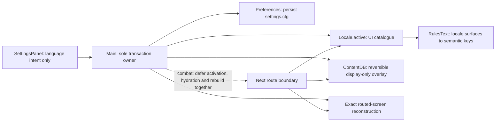

# P7 localisation milestone review board

Status: **DELIVERY PASS — the historical governance exception is recorded;
parent merge and close remain.** Issues
[#98](https://github.com/fol2/glassvow/issues/98)–[#104](https://github.com/fol2/glassvow/issues/104)
are closed and all thirteen child-delivery pull requests in this board are
merged. The closure correction makes translated card keywords style and resolve
tooltips through the active locale. Its production point of record is
[`092d577d51ee7e62303aff42b983295f7caa3cb7`](https://github.com/fol2/glassvow/commit/092d577d51ee7e62303aff42b983295f7caa3cb7);
the commits after it in the closure candidate change documentation only.

Parent issue [#7](https://github.com/fol2/glassvow/issues/7) remains open until
closure PR
[#141](https://github.com/fol2/glassvow/pull/141) carries the runtime correction,
this board and the required independent review/CI receipts. Its expected close
point is that PR's merge; the administrative state does not reopen completed
child scope.

The closure audit found three historical process gaps. PRs
[#116](https://github.com/fol2/glassvow/pull/116) and
[#117](https://github.com/fol2/glassvow/pull/117) merged without the binding PM
verdict comment being recorded first. PR #117's English-seed commit
[`e1ff22d`](https://github.com/fol2/glassvow/commit/e1ff22d1fd6543db5777a5a0c41fb5e8ec54a57d)
changed 1,836 lines, above the binding 400-line review limit. Its screenshot
record names implementer-local English-after paths only, with no retrievable
hosted before/after pair. Later integrated evidence can establish the delivered
runtime contract, but it cannot rewrite or backdate those decisions. James
[approved the narrow historical exception](https://github.com/fol2/glassvow/issues/7#issuecomment-5264971463)
on 12 August 2026. It covers only these three process defects and explicitly
does not waive functional defects, P8 gates or future guardrails.

This is an evidence index, not new runtime scope. Automated catalogue and
runtime proof, headed visual evidence, and human register acceptance are kept
as separate lanes below. **P8 QA/release remains a separate milestone and has
not started.**

## Exit decision

| Gate | Result | Decision |
|---|---|---|
| P7.1–P7.7 child delivery | Issues #98–#104 closed; thirteen child-delivery PRs merged | **Pass** |
| Historical governance record | PRs #116/#117 lack before-merge PM verdicts; PR #117 also exceeded the commit-size limit and lacks hosted before/after evidence | **Narrow owner exception approved and recorded** |
| English and Traditional Chinese catalogue completeness | 1,197 / 1,197 string leaves; all structural drift counters zero | **Pass** |
| Active-language card keywords | 21 term leaves per catalogue; translated styling and semantic tooltip resolution | **Pass** |
| Traditional Chinese register sample | Title, one complete fight, one event, and whispers 0/11/23 accepted by James at the #139 head | **Pass — historical sample** |
| Persisted live switching | English ↔ Traditional Chinese, exact-route rebuild, combat deferral and latest-request-wins covered | **Pass** |
| Closure PR review and hosted CI | PR #141 records independent PM/software-completeness approval and two successful `test` jobs plus GitGuardian | **Pass** |
| Compatibility boundaries | Fixtures, stable IDs, v2 saves and plugins retain their contracts | **Pass** |
| P8 QA/release | Separate scope; no P8 execution claimed | **Not started** |

## Architecture delivered



- [`Locale`](https://github.com/fol2/glassvow/blob/092d577d51ee7e62303aff42b983295f7caa3cb7/application/locale.gd)
  is a `RefCounted` catalogue, published by `Main` rather than an autoload. It
  resolves requested language → English → key and preserves interpolation
  markers.
- Content translation is a reversible overlay over the seventeen live
  `ContentDB` domains. Only approved display strings are writable; IDs remain
  lookup keys, missing rows are skipped, and returning to English restores the
  baked catalogue exactly.
- [`SettingsPanel`](https://github.com/fol2/glassvow/blob/092d577d51ee7e62303aff42b983295f7caa3cb7/presentation/run/settings_panel.gd)
  reports intent. [`Main`](https://github.com/fol2/glassvow/blob/092d577d51ee7e62303aff42b983295f7caa3cb7/application/main.gd)
  owns persistence, catalogue activation, content hydration and exact-route
  reconstruction as one transaction.
- During combat the active UI catalogue and hydrated content stay on one
  language. A new request replaces the pending target; choosing the active
  language cancels it. The next route boundary applies the surviving request.
- [`Preferences`](https://github.com/fol2/glassvow/blob/092d577d51ee7e62303aff42b983295f7caa3cb7/application/preferences.gd)
  persists the explicit choice in `user://settings.cfg`; without one, any
  `zh*` OS language selects `zh-Hant` and every other language selects English.
- [`RulesText`](https://github.com/fol2/glassvow/blob/092d577d51ee7e62303aff42b983295f7caa3cb7/presentation/combat/rules_text.gd)
  matches active-locale term surfaces and maps each run back to a stable
  semantic key. `CardView` draws the dotted term styling and
  `CombatScreen._keyword_tip()` resolves either the hydrated status description
  or the shared glossary body without making translated text a mechanics key.
- Shipping Cinzel/Alegreya display faces route through
  [`GlassStyle.face()`](https://github.com/fol2/glassvow/blob/092d577d51ee7e62303aff42b983295f7caa3cb7/presentation/combat/glass_style.gd),
  which chains Noto Sans TC. The non-English title uses its catalogue wordmark.

The design of record remains [`p7-locale-design.md`](p7-locale-design.md); the
canonical terminology remains [`zh-hant-glossary.md`](zh-hant-glossary.md).

## Child-issue closure board

All states in this table were rechecked on GitHub on 10 August 2026.

| Child | Delivered contract | Delivery chain | State |
|---|---|---|---|
| [#98 — P7.1](https://github.com/fol2/glassvow/issues/98) | Generator boundary, inventory, key scheme and wave design | [#116](https://github.com/fol2/glassvow/pull/116) | Closed |
| [#99 — P7.2](https://github.com/fol2/glassvow/issues/99) | Main-owned locale loader and English seed | [#117](https://github.com/fol2/glassvow/pull/117) | Closed |
| [#100 — P7.3](https://github.com/fol2/glassvow/issues/100) | Run-screen extraction | [#118](https://github.com/fol2/glassvow/pull/118), [#125](https://github.com/fol2/glassvow/pull/125), [#132](https://github.com/fol2/glassvow/pull/132), [#133](https://github.com/fol2/glassvow/pull/133) | Closed |
| [#101 — P7.4](https://github.com/fol2/glassvow/issues/101) | Combat and adjacent-screen extraction | [#125](https://github.com/fol2/glassvow/pull/125), [#132](https://github.com/fol2/glassvow/pull/132), [#134](https://github.com/fol2/glassvow/pull/134), [#137](https://github.com/fol2/glassvow/pull/137), [#138](https://github.com/fol2/glassvow/pull/138) | Closed |
| [#102 — P7.5](https://github.com/fol2/glassvow/issues/102) | Help, whispers, events, quests, dialogs and persistence prose | [#125](https://github.com/fol2/glassvow/pull/125), [#132](https://github.com/fol2/glassvow/pull/132), [#136](https://github.com/fol2/glassvow/pull/136) | Closed |
| [#103 — P7.6](https://github.com/fol2/glassvow/issues/103) | Complete `zh-Hant` catalogue, canonical register and CJK font paths | [#135](https://github.com/fol2/glassvow/pull/135), [#137](https://github.com/fol2/glassvow/pull/137), [#138](https://github.com/fol2/glassvow/pull/138), [#139](https://github.com/fol2/glassvow/pull/139) | Closed |
| [#104 — P7.7](https://github.com/fol2/glassvow/issues/104) | Persisted, state-safe live language switching | [#140](https://github.com/fol2/glassvow/pull/140) | Closed |

### Binding phase blockers

The management update made both blockers part of P7's critical path; both are
closed rather than hidden inside their delivery PR rows.

| Blocker | Resolution | Closing PR | State |
|---|---|---|---|
| [#127 — generated Shade names](https://github.com/fol2/glassvow/issues/127) | Catalogue pattern plus bare authored aspect name | [#135](https://github.com/fol2/glassvow/pull/135) | Closed |
| [#128 — cache-cold font import](https://github.com/fol2/glassvow/issues/128) | Correct font-load order plus a gate that fails on import errors | [#129](https://github.com/fol2/glassvow/pull/129) | Closed |

## Pull-request merge ledger

These thirteen merged PRs are the direct localisation delivery ledger.

| PR | Merged responsibility | Merge commit |
|---|---|---|
| [#116](https://github.com/fol2/glassvow/pull/116) | P7.1 locale design: generator boundary and literal inventory | [`f0df659`](https://github.com/fol2/glassvow/commit/f0df659c143f79a027fedd9fc293c172641b644a) |
| [#117](https://github.com/fol2/glassvow/pull/117) | P7.2 `application/locale.gd` and `locale/en.json` | [`b3fe4ac`](https://github.com/fol2/glassvow/commit/b3fe4ac6517e5d23da7bb9559ee1df89614c93e8) |
| [#118](https://github.com/fol2/glassvow/pull/118) | First P7.3 run-screen extraction | [`cd42784`](https://github.com/fol2/glassvow/commit/cd427841cd4d0ce2908da1c8b854bf09e1933d5c) |
| [#125](https://github.com/fol2/glassvow/pull/125) | Reversible authored-content hydration across P7.3–P7.5 | [`f1756b3`](https://github.com/fol2/glassvow/commit/f1756b32975fd0cc0a100375e6f983e77ad2f682) |
| [#132](https://github.com/fol2/glassvow/pull/132) | Remaining English key inventory and lane ownership map | [`62e002a`](https://github.com/fol2/glassvow/commit/62e002a5bc64f2c481672966ebdf24b596db1995) |
| [#133](https://github.com/fol2/glassvow/pull/133) | Remaining P7.3 run screens | [`1858c35`](https://github.com/fol2/glassvow/commit/1858c35b2392f725ae6ca1f2d13e8a7caf8ed12a) |
| [#134](https://github.com/fol2/glassvow/pull/134) | P7.4 combat chrome and adjacent surfaces | [`506da40`](https://github.com/fol2/glassvow/commit/506da4040947715a30d6c6c98d53619599b36e69) |
| [#135](https://github.com/fol2/glassvow/pull/135) | Catalogue-driven generated Shade names; closes [#127](https://github.com/fol2/glassvow/issues/127) | [`9934968`](https://github.com/fol2/glassvow/commit/99349685c4c34a23ef10760ed14a6b75b779ea1a) |
| [#136](https://github.com/fol2/glassvow/pull/136) | P7.5 remaining prose and persistence copy | [`581bece`](https://github.com/fol2/glassvow/commit/581bece9732c3808128d110720fb37b77c79f8a3) |
| [#137](https://github.com/fol2/glassvow/pull/137) | Catalogue keys for mechanically derived display labels | [`4d8b6fa`](https://github.com/fol2/glassvow/commit/4d8b6faf615d37672e31f938fb4eb8c59301bc50) |
| [#138](https://github.com/fol2/glassvow/pull/138) | Derived card-type and rarity-label consumers | [`58a6f4b`](https://github.com/fol2/glassvow/commit/58a6f4b6aa0f06ae4a04ad7366a703bb8f116a65) |
| [#139](https://github.com/fol2/glassvow/pull/139) | Complete Traditional Chinese release catalogue and display-face fallbacks | [`b388796`](https://github.com/fol2/glassvow/commit/b388796763b1e47f1905ad9d27665ab381b06c5b) |
| [#140](https://github.com/fol2/glassvow/pull/140) | P7.7 atomic, persisted live language switching | [`2a02944`](https://github.com/fol2/glassvow/commit/2a02944c7aba902155ac9b7b99f7835338dba0b0) |

### Critical-path foundations and prerequisites

These four merged PRs made the P7 proof path trustworthy. They are recorded
separately rather than misclassified as direct localisation deliverables.

| PR | Foundation responsibility | Merge commit |
|---|---|---|
| [#120 — Initialise the title projection before its first paint](https://github.com/fol2/glassvow/pull/120) | Correct first-paint title projection before title evidence | [`ceebfb1`](https://github.com/fol2/glassvow/commit/ceebfb1b4517dead212fe0d4c4ba3e82f58c958b) |
| [#122 — Make the per-file parse gate able to fail (#82)](https://github.com/fol2/glassvow/pull/122) | Replace a false-green parse loop with the enforceable script gate | [`911e5ca`](https://github.com/fol2/glassvow/commit/911e5ca67094beca5a106290023c3eb484da08c2) |
| [#124 — Point the rest-heal gate at the live path; make the projection check a contract (#83)](https://github.com/fol2/glassvow/pull/124) | Put two supporting regressions on their production seams | [`0a40e3c`](https://github.com/fol2/glassvow/commit/0a40e3c8295e98dcd6a944d7168bfaddc45918e0) |
| [#129 — Fix cache-cold asset import gate](https://github.com/fol2/glassvow/pull/129) | Make cache-cold font import errors fail the gate; closes [#128](https://github.com/fol2/glassvow/issues/128) | [`2215591`](https://github.com/fol2/glassvow/commit/22155918bd85ee54dc0b1a699a09807b277f119a) |

## Automated proof board

PR #140's final feature head
[`7391d99256f356c576bd4cd7a3a3af05c5184c27`](https://github.com/fol2/glassvow/commit/7391d99256f356c576bd4cd7a3a3af05c5184c27)
and its `main` merge point share tree
`813976f07c1b8f6f1870bcb3dd18050e2278d1b0`. That remains the historical
live-switch receipt. The translated-keyword correction is separately bound to
production commit
[`092d577d51ee7e62303aff42b983295f7caa3cb7`](https://github.com/fol2/glassvow/commit/092d577d51ee7e62303aff42b983295f7caa3cb7);
every later commit in this closure candidate changes documentation only.

| Gate | Recorded result | Status |
|---|---|---|
| Engine | `4.7.1.stable.official.a13da4feb` | Pass |
| Asset import | `tools/check_imports.sh` → `asset import OK` | Pass |
| GDScript parse + warnings | `tools/check_scripts.sh` → `scripts OK (139 checked)` | Pass |
| Headless suite | `godot --headless -s res://tests/run_all.gd` → `PASS (22 tests)` | Pass |
| Repository anchors | `python3 tools/check_anchors.py` → `anchors OK` | Pass |
| Pinned benchmark anchors | `python3 tools/check_web_anchors.py` → `web-reference anchors OK` | Pass |
| Historical hosted CI at the PR #140 merge point | [`CI run 31342583837`](https://github.com/fol2/glassvow/actions/runs/31342583837), `test` completed successfully | Pass |
| Closure runtime plus pre-decision board CI | Head `06139ce`: [`31348081273`](https://github.com/fol2/glassvow/actions/runs/31348081273) → `test` pass in 1m36s; [`31348083980`](https://github.com/fol2/glassvow/actions/runs/31348083980) → `test` pass in 2m9s; GitGuardian pass | Pass |
| Final owner-decision documentation head | PR [#141](https://github.com/fol2/glassvow/pull/141) Checks tab; two successful `test` jobs plus GitGuardian are required before merge and linked in the final #7 summary | **Merge gate** |

The two anchor checks are exact-head local receipts; they are not presented as
CI steps. Hosted CI independently reruns import, the two gate self-tests, script
checks, the headless suite and phone-landscape reachability.

The correction-specific behavioural proof is deliberately narrower and deeper:

- a real English → Traditional Chinese switch styles `護光`, `陰燃` and `燃燼`,
  invalidates the cached English matcher, and resolves both hydrated status and
  shared glossary tooltips through a real `CombatScreen`;
- removing cache invalidation, ASCII word boundaries or semantic status lookup
  makes named assertions fail before each mutation is restored;
- all 118 live English card `text`/`textUp` token streams are byte-for-byte equal
  before and after the correction; and
- the Traditional Chinese probe covers 21 term leaves, 18 unique rendered
  surfaces, 13 surfaces used by live cards, 90 card fields and 130 raw
  occurrences, with every occurrence tokenised to the expected semantic key.

### Final catalogue and keyword census

The immutable #103 receipt predates the 21 presentation-only keyword-term
leaves. The correction receipt records the complete final catalogue:

```text
en_strings=1197 zh_strings=1197
missing=0 extra=0 unexpected_blank=0
unallowed_identical=0 marker_drift=0
visible_latin_paths=29 expected_latin_paths=29 latin_allowlist_drift=0
card_names=61 card_name_collisions=0
keyword_semantic_arrays=17 keyword_terms_per_catalogue=21
zh_unique_keyword_surfaces=18 live_surfaces=13 fields=90 occurrences=130
```

This proves catalogue shape, coverage, marker preservation, the explicit
Latin-script policy, unique card display names and semantic keyword mapping. It
does not judge translation quality, tone, wrapping, clipping or typography.

### Human register and visual decision

The [recorded human sign-off](https://github.com/fol2/glassvow/pull/139#issuecomment-5234239874)
accepted the exact-head evidence for all required samples:

| Sample | Decision |
|---|---|
| Traditional Chinese title | Passed |
| One complete fight | Passed |
| One event | Passed |
| Stable whispers 0, 11 and 23 | Passed |

That decision judges the sampled register and rendered presentation. It does
not replace the all-leaf catalogue tests or the state-preservation runtime
tests. Conversely, automated tests do not replace a human judgement of prose,
visual hierarchy or CJK wrapping. The boards below are immutable review
objects, not a claim that every one of the 1,197 lines was seen on screen. The
#139 decision predates the keyword-interaction correction: it remains the
required title/fight/event/whisper register sample, but is not presented as a
retrospective human approval of the new tooltip interaction.

## Immutable headed visual evidence

All three evidence commits below are intentionally branch-only: none is in
`main` ancestry. Their full commit URLs and manifests are the immutable
evidence references; they are not runtime delivery commits and must not be
mistaken for the feature merge point.

### P7.6 — catalogue, register and display faces

Evidence commit:
[`8dcb84c90456aedc9d70025a6b982efbb53fe1df`](https://github.com/fol2/glassvow/tree/8dcb84c90456aedc9d70025a6b982efbb53fe1df).
The [image manifest](https://github.com/fol2/glassvow/blob/8dcb84c90456aedc9d70025a6b982efbb53fe1df/receipts/image-manifest.txt)
binds SHA-256 and dimensions for every source image and contact sheet.

| Pad-landscape full run | Phone-portrait full run |
|---|---|
|  |  |


### P7.7 — live switch and combat deferral

Evidence commit:
[`cd1235a86d74955fc81e5a079ab478c6d41fce88`](https://github.com/fol2/glassvow/tree/cd1235a86d74955fc81e5a079ab478c6d41fce88).
The [manifest](https://github.com/fol2/glassvow/blob/cd1235a86d74955fc81e5a079ab478c6d41fce88/manifest.md)
binds the ten source captures to their dimensions and SHA-256 values.

The manifest binds the captures to production head
[`7e82cf4`](https://github.com/fol2/glassvow/commit/7e82cf4b76717b7c37a612858960b0eb04814edf).
The final reviewed head
[`7391d99`](https://github.com/fol2/glassvow/commit/7391d99256f356c576bd4cd7a3a3af05c5184c27)
adds only the 92-line latest-request-wins regression in
`tests/test_locale_hydration_main.gd`; it does not alter the photographed
production tree. The exact-head
[Design Lead](https://github.com/fol2/glassvow/pull/140#issuecomment-5234454618)
and [software-completeness](https://github.com/fol2/glassvow/pull/140#issuecomment-5234454656)
verdict comments revalidated that applicability bridge.

| Pad language matrix | Phone language matrix |
|---|---|
|  |  |


### Closure correction — translated card keywords and tooltips

Evidence commit:
[`38e4deb911ec432bfa610e2e680461ee86eebbde`](https://github.com/fol2/glassvow/tree/38e4deb911ec432bfa610e2e680461ee86eebbde).
The [manifest](https://github.com/fol2/glassvow/blob/38e4deb911ec432bfa610e2e680461ee86eebbde/manifest.md)
binds the raw images to production commit `092d577d`, their dimensions and
SHA-256 values. The real `CombatScreen`, `RulesText`, `CardView` and
`TooltipLayer` render both views. The macOS GUI session was locked, so a
temporary uncommitted capture-host command asked the real tooltip source at the
measured keyword point and froze its normal mouse placement on pad and touch
placement on phone. That command was restored before publication and is not
production code.

| Pad-landscape keyword tooltip | Phone-portrait keyword tooltip |
|---|---|
|  |  |

These images prove rendered styling, copy and containment only. The real
runtime tests and independent token probes above prove active-language
tokenisation and semantic tooltip resolution. Neither lane claims pointer
hit-testing or event-dispatch proof.

## Compatibility and scope boundaries

| Boundary | P7 result |
|---|---|
| Generated fixtures | `port_fixtures/` is unchanged; P7 did not regenerate or edit parity fixtures. |
| Stable IDs and mechanics | Locale overlay writes approved display leaves only and retains IDs as keys. Keyword-term leaves are presentation-only locale data. Hostile-locale and runtime fingerprints keep mechanics and catalogue IDs unchanged. |
| Save v2 | `application/save_service.gd` and the v2 run/vigil envelope remain unchanged. Switching preserves the exact run save dictionary, map projection and RNG cursor; only the separate `settings.cfg` gains the language choice. |
| Plugins and native scope | No addon, editor-plugin or platform-plugin implementation is part of P7. |
| Domain purity | `domain/` remains free of `Locale`; Hollow messages cross as stable tokens and resolve at the presentation boundary. |

## Compound documentation refresh

The required non-interactive refresh ran after the milestone artefact and the
compound learning. Its [full per-document report](p7-localisation-compound-refresh.md)
records one learning scanned and kept; every other classification is zero. The
three in-scope `CONCEPTS.md` terms were accurate, so the refresh applied nothing
and recommended nothing. The post-correction check keeps that classification:
keyword matching adds presentation coverage beneath `Locale.active` without
changing Main's transaction ownership or order. Discoverability passed without
an instruction-file edit.

## P8 handoff

P7's runtime, catalogue, evidence and historical-decision gates are complete;
parent closure follows this board's merge and summary comment. **P8 QA/release
remains separate and has not started.** P8 must establish its own scope,
execution record and release decision; this P7 census, CI result and visual
sign-off do not pre-approve that later milestone.
