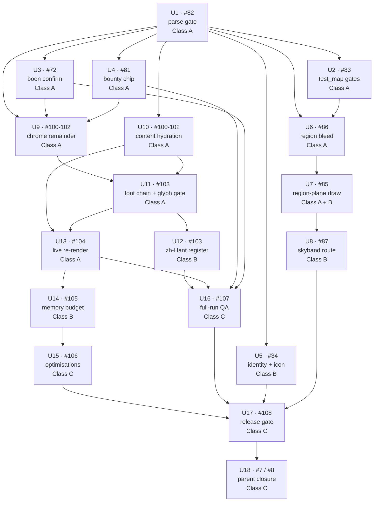

# Close the Open Issue Backlog (P7 completion, map band, release gate) - Plan

## Goal Capsule

**Objective.** Drive all 19 open issues on `fol2/glassvow` to a recorded outcome, in one of three states: **closed** by merged work; **prepared** to a single named human decision; or **blocked** behind a named upstream signature, with that signature identified. Nothing silent.

Expect the third state for the Class C tail (#106, #107, #108, #7, #8) on any single execution pass — the chain into #108 runs through at least four serialised human decisions (register, budgets, Design Lead verdict, release signature). Saying so here is the point: KTD-2's call-out refuses to claim 19 closures this plan cannot deliver, and the objective must not re-claim them.

**Authority hierarchy.** `AGENTS.md` (`CLAUDE.md` is a symlink to it) > `.claude/skills/glassvow-godot/SKILL.md` > `docs/session-ownership.md` > the issue body > this plan. Where an issue's prose and `docs/p7-locale-design.md`'s measured inventory disagree, **the inventory wins** (that doc's own rule, §4).

**Execution profile.** Units that may run **concurrently** must not both edit a file listed in either's `Files:`. Units that share a file are either placed in the same group and serialised within it (as U6 → U7 → U8 are on `presentation/map/map_band.gd`), or given an explicit dependency edge when they sit in different groups. The `Group` column marks which units *may* overlap; the `Depends on` column and the Sequencing table's collision rows are what actually order them, and they win.

**Landing strategy.** One PR per unit, targeting `main`, each *referencing* the issue it advances — **never with a GitHub closing keyword** (`Closes` / `Fixes` / `Resolves`). GitHub acts on those automatically at merge, which would close an issue without James's verdict; write `Advances #82` or `Part of #82`. Not one branch for the plan — the repo's governance requires a guardrail verdict comment per task PR, and `SKILL.md` §9 makes >400 changed lines in a task a hard stop.

**Stop conditions (binding, from `SKILL.md` §9 and the phase parents).**
1. Save-schema change — halt, plan separately. Schema v2 is frozen; localisation renames nothing persisted.
2. Native platform plugin work — out of scope.
3. Any single unit exceeding **400 changed lines** — stop, report, re-plan. This is why the locale waves are per-screen commits.
4. A unit whose acceptance criteria name a human decision — implement to the decision line, post the options and the measurement on the issue, and **stop**. Do not self-sign a guardrail verdict.

**Tail ownership.** The executor does not close issues or post guardrail verdicts. It lands PRs and posts evidence comments. Closure is James's.

---

## Product Contract

### Summary

Nineteen issues are open across the P7 (localisation) and P8 (release gate) phases plus a defect ledger. An adversarial triage graded them: **0 closable, 8 partial, 11 open**. This plan repairs the verification gate that lets partial work look finished, completes the localisation work that landed as plumbing without a read path, resolves the map band's three linked art blockers, fixes two legibility/reachability defects, and stages the release gate to the point where each remaining decision is a single signature.

### Problem Frame

The repo's verification contract cannot fail on parse errors: `godot --headless --check-only -s <file>` prints diagnostics to stderr and exits 0, so the `|| exit 1` loop in `AGENTS.md` and `.github/workflows/ci.yml:25` has never once caught a defect. What has been protecting the tree instead is `tests/run_all.gd` — and only as a side effect, because a parse error in a script the suite compiles makes `load()` return null and the run fail. That is a real gate, but it is not the gate the docs claim, and nothing measures its edges.

That broken gate is the mechanism behind the second problem. PR #118 landed under a green suite claiming "P7.3 through P7.7 landed on this branch"; the suite was genuinely green and the catalogues genuinely reached exact key parity (998 leaves each, 0 missing, 0 extra). But no gate asked whether anything *reads* them. `Locale.content()` has **0 production call sites**, so every card, relic, enemy, event and quest name is authored in both languages and displayed from neither. Key parity looked like completion.

The map band carries a third, independent problem: `MapBand.RegionBand` draws its strip into a rect whose top edge is exactly the horizon, while the procedural fallback it replaces stands trees whose crowns rise up to `span_y × 0.67` above that line. No band can currently draw architecture across the horizon, which blocks region art (#86) and the painted terminus (#85), and leaves the skyband decision (#87) unmade.

### Requirements

**Verification integrity**

- R1. The per-file parse gate fails when a `.gd` file has a parse error, in one script shared by the local gate and CI, so the two cannot drift. (#82)
- R2. The suite's true parse coverage is measured by transitive load closure — not by subtracting entry points — and recorded as the answer of record to #82's open question. (#82)
- R3. `AGENTS.md` §Verification and `SKILL.md` §5 describe what the gate actually enforces. (#82 items 2, 5, 6)
- R4. `tests/test_map.gd`'s rest-heal assertion targets the function the game calls, and its save-projection check either compares the fields that matter or is renamed to what it checks. (#83)

**Localisation completion**

- R5. Content display fields (card/relic/enemy/event/quest `name`, `text`, `up.text`, choice `label`/`sub`) resolve through the active locale, by hydrating `ContentDB` rows at boot and at language select — the mechanism `docs/p7-locale-design.md` §3 specifies. (#100, #101, #102)
- R6. UI chrome that waves 1–3 left in English is extracted: the screens still absent from the `Locale` read path. (#100, #101, #102)
- R7. Every production font load routes through `GlassStyle.face()`, which owns the NotoSansTC fallback chain, rather than bypassing it with a raw `load()`. (#103)
- R8. A glyph gate asserts a zh-Hant glyph renders non-tofu through each display face, and the gate is mutation-proofed. (#103)
- R9. Switching language re-renders every route, not only the map. Persistence, the OS-derived default and the Settings control already exist and are verified; the live re-render is the gap. (#104)
- R10. `locale/zh-Hant.json` is authored in register against a fixed glossary, with `@n@` / `#n#` markers preserved byte-for-byte. **Human-gated: James signs the register.** (#103)

**Map band and legibility**

- R11. The region strip may draw above the horizon by a bleed derived as a ratio of `span_y`, gated over `StageShape.REFERENCES` so it cannot reach into the sky band's territory. (#86)
- R12. A singular, world-anchored, untiled scenery draw path exists on the region plane, gated over the shape matrix in the spirit of the existing arch-fit assertion. (#85)
- R13. The skyband route is decided between painted art, an in-band procedural draw, and shipping nothing; synthesis is never baked to PNG. **Human-gated: the route is a design call.** (#87)
- R14. The bounty chip clears a stated legibility threshold, measured on the running map at phone-landscape and phone-portrait. (#81)
- R15. The boon screen's confirm control is reachable at phone-landscape (844×390) by touch and by keyboard. (#72)

**Platform identity and release**

- R16. Platform identity's four mechanisable requirements are verified closed and the icon choice is presented as a decision with candidates rendered. **Human-gated: James picks the icon.** (#34)
- R17. The memory budget placeholder in `docs/commercial-game-delivery.md:60` is replaced with measured numbers from a re-run of `tools/bench_actor_stage.gd`. **Human-gated: James signs the budgets.** (#105)
- R18. Post-approval optimisations are judged at 1:1 against a before capture with an established noise floor. **Gated on R17 signed and visual approval standing.** (#106)
- R19. A full-journey QA protocol is run headed at both aspects × two shapes in both languages, with resume-from-kill at every route, and every open defect receives a recorded verdict. (#107)
- R20. The release gate cites only gates that can fail, and each of its five lines is discharged or explicitly waived. **Human-gated: James signs the release.** (#108)
- R21. Parents #7 and #8 close with a phase summary once their children are closed or waived.

### Scope Boundaries

**In scope.** All 19 open issues, to the completion class each admits (see KTD-3).

**Deferred to follow-up work.**
- PR #120 (`fix/title-projection-before-first-paint`) is open and unrelated to this backlog. It lands or closes on its own.
- `p6/b8-autonomous-gate` still holds an unrouted `tools/live.sh` env-override change. `tools/` is organiser-owned; that is an organiser event, not a unit here.
- `assets/layout/combat-layout.json` is misnamed (it holds `map`, `run` and `reward` scopes). Renaming is cited in eleven places and is an organiser event.

**Outside this plan's identity.**
- Re-authoring the English copy. Extraction moves strings; it never improves them (`docs/p7-locale-design.md` §4, P7.5).
- Machine-translating zh-Hant. The phase bar is explicit: "Bulk machine translation fails review."
- Baking procedural synthesis to PNG for the skyband (#87's one named anti-goal).
- Editing `port_fixtures/` or `tools/` from a feature unit.

### Assumptions

- A1. The executor cannot post guardrail verdicts or close issues. Every human-gated unit ends with an evidence comment on its issue and stops. If the pipeline later gains that authority, it changes who signs, not what the work is.
- A2. GitHub Actions recovered on 2026-08-06 — the 17:40Z run on `main` executed and concluded `success`. The durable lesson stands: a `CLEAN` merge state with **zero executed checks** is a false green, so read the run list rather than the merge state. U1's CI edit must be confirmed by a run that actually executed, not by local gates alone.
- A3. A stray `godot --headless … --shot=` process (pid 91500, 165 min CPU) belongs to another session and contends for the project directory. Long `godot` invocations here may need a timeout.

---

## Planning Contract

### Key Technical Decisions

**KTD-1. The parse gate is repaired first, alone, before any other unit.**
Rationale: it is the first line of the verification contract every other unit runs, and #108 names it as release-gate line 1. Sequencing it first also means every later unit's "gates green" claim means something. The cost is one serialised unit at the head of the plan.

**KTD-2. Scope is all 19 open issues, worked with parallel fan-out.**
(session-settled: user-directed — chosen over taking #82 alone first as a single sequential fix: the user overrode the single-issue proposal with "complete all github issues listed" plus an explicit fan-out instruction.)

> **Conflict call-out.** Nine issues have acceptance criteria that name a human decider: #34 ("James picks the icon"), #103 ("James signs the register"), #105 ("James signs the budgets"), #106 (the Design Lead's "cannot be told apart" verdict), #107 (defect verdicts — "James says it"), #108 ("James signs the release" plus a human visual review), #87 (the route decision), #85 (item 4, a design call to be made on the running map), and #81 (candidate directions, "none chosen"). Separately, every task closes through a PR carrying a guardrail verdict comment — and an executor posting its own verdict is precisely the failure that let PR #118 merge without satisfying #101/#103/#104. The decision is workable, not invalidating: the majority of the work is mechanisable, and the rest is prepared to the signature line. It proceeds as settled, with completion classes made explicit in KTD-3 rather than the plan claiming 19 closures it cannot deliver.

**KTD-3. Completion is judged against each issue's own acceptance criteria, and units are typed by which class of completion they admit.**
(session-settled: user-approved — chosen over treating a merged PR whose title names an issue as closing that issue: this session merged PR #118 on green gates and it did not satisfy #101/#103/#104, which is the failure that motivated the triage.)
Three classes, carried per unit:
- **Class A — agent-closable.** Every acceptance criterion is mechanisable and measurable. The unit lands a PR and posts evidence.
- **Class B — agent-prepared, human-decided.** Work runs to the decision line; the unit posts the options, the measurement, and a recommendation, then stops.
- **Class C — gated.** Cannot start until Class A/B work upstream is closed or waived.

**KTD-4. Content localisation lands as a `ContentDB` hydration overlay, not as call-site rewrites.**
Rationale: `docs/p7-locale-design.md` §3 already settled this — copy `content.*` strings onto the live row fields the presentation already reads, mirroring the web `hydrateContent`. Presentation keeps reading `name` / `text` / `up.text` unchanged, so the diff is one hydration function plus its call sites at boot and language-select, not ~500 edits across the presentation layer. The English bake in `content/full-content.json` stays as the mechanics catalogue and parity source. This is why R5 is small enough to respect the 400-line stop condition.

**KTD-5. Parallelism is by disjoint file ownership in the shared tree, not by git worktrees.**
Rationale: `docs/session-ownership.md` already defines a lane model the repo runs on, and each Godot worktree needs its own asset import — real cost per lane for a conflict class that file-disjointness already prevents. Where two units would touch one file, they are serialised — inside a group where that is natural, otherwise by an explicit dependency edge. Verified consequence: `presentation/map/map_band.gd` is touched by #85, #86 and #87, so **those three are serial**; #81 touches a disjoint set (`glass_waystone.gd`, `world_map_screen.gd`, `assets/layout/combat-layout.json`) and runs parallel to them.

**KTD-6. The docs' "warnings-as-errors" claim is true; only its enforcement is broken. #82 item 6 resolves as a correction to the issue, not to the docs.**
Measured this session from the repo root: a file containing `var x = 1` produces `Parse Error: Variable "x" has no static type. (Warning treated as error.)` on stderr and still exits 0. `project.godot` sets `untyped_declaration`, `inferred_declaration`, `unsafe_cast` and `unsafe_call_argument` to level 2. The fix is therefore the stderr grep alone; the doc wording changes from claiming the gate enforces to stating that the exit code does not.

Post the **reproduction** as the correction on #82, not a diagnosis of why the issue's contrary reading ("`var x = 1` — printed: —") differed. That earlier run was taken in a worktree, which does carry `project.godot`, so any explanation of the divergence is itself unmeasured — and replacing one unverified claim with another is the failure this unit exists to end.

**KTD-7. Repairing the gate does not light up a backlog.**
A full stderr-based sweep of all 133 non-addon `.gd` files this session flagged **0**. U1 can turn on a real gate without a remediation wave. Recorded because the opposite would have reshaped the whole plan.

**KTD-8. One PR per unit, not one branch for the plan.**
Rationale: `SKILL.md` §9 makes >400 changed lines a hard stop, and both phase parents require a guardrail verdict comment per task PR. A single branch carrying twenty units could satisfy neither.

**KTD-9. `tools/` is read-only to every unit except U1.**
(session-settled: user-directed — chosen over letting any unit edit `tools/` freely: concurrent lanes sharing one tree corrupt each other's verification harness.)
`docs/session-ownership.md` › Organiser-owned files states the asymmetry: every lane is expected to *run* what is in `tools/`, no lane may *edit* it. U1 is the sole carve-out because repairing the parse gate **is** a `tools/` change — it is that issue's acceptance criterion (#82 item 1), not a convenience.

**KTD-10. The parity reference is `~/Coding/roguecardv2-benchmark` @ `6e06911` (pre-Pixi).**
(session-settled: user-directed — chosen over reading parity specs from `~/Coding/roguecardv2` on `main`: the two checkouts diverge in exactly the visual files parity work touches.)
The `main` checkout is 284 commits ahead and post-Pixi. Reading it produced three commits against code the benchmark does not contain on 2026-07-26, all reverted or redone. `python3 tools/check_web_anchors.py` enforces this and is in the Verification Contract.

### High-Level Technical Design

Dependency structure. Every edge is a real constraint; absence of an edge is not a claim of disjointness — the Sequencing table's collision rows are authoritative.



The three parallel fronts after U1 are **defects** (U2–U5), **map band** (U6→U7→U8, serial on `presentation/map/map_band.gd`), and **locale** (U9/U10 → U11, then U12 and U13 in parallel). They converge at **U17** — locale through U13 → U14 → U15, defects through U3/U4 → U16 and U5 direct, map through U8 direct. U12 is the human-gated register; it rejoins at U16, not U13.

### Sequencing

| Group | Units | Concurrency |
|---|---|---|
| Gate | U1 | Serial. Blocks everything. |
| `parallel:defects` | U2, U3, U4, U5 | All four concurrent — file sets disjoint. |
| `parallel:map` | U6 → U7 → U8 | Serial within the group; concurrent with `defects` and `locale`. |
| `parallel:locale` | U9 ∥ U10 → U11 → (U12 ∥ U13) | U9 and U10 concurrent. U11 is a barrier (see collisions). U12 and U13 then run concurrently — U12 is the human-gated register, U13 the code fix; U12 rejoins at U16. |
| Release | (U14 → U15) ∥ U16 → U17 → U18 | U15 and U16 are concurrent — disjoint files, and U16 does not need the budget signature. U17 waits on both. |

**Cross-group file collisions — sequence, never overlap.** Group membership is not sufficient on its own; these three pairs sit in different groups but share a file:

| File | Units | Resolution |
|---|---|---|
| `presentation/run/lamplighter_screen.gd` | U3 (scroll fix), U9 (extraction) | U3 first — smaller diff; U9 then extracts the final layout's strings. |
| `application/main.gd` | U2 (rest-heal path), U10 (hydration call sites), U13 (re-render) | U2 → U10 → U13. U2's edit is a removal, so it goes first. |
| `tests/test_map.gd` | U2 (gate rewrites), U6 (bleed gate), U7 (shape gate) | U2 → U6 → U7 — each appends to a file the previous one settled. |
| `presentation/map/world_map_screen.gd` | U4 (chip floor), U9 (`REGION_NAME` extraction) | U4 first; U9 then extracts the final literals. |
| `presentation/combat/glass_style.gd` | U11 only — **barrier** | 23 consumers. No other presentation unit may be open while U11 is. Close U3, U4, U6–U8 and U9 first. |

---

## Implementation Units

### Unit Index

| U-ID | Title | Key files | Depends on | Group | Class |
|---|---|---|---|---|---|
| U1 | Repair the parse gate | `tools/check_scripts.sh`, `AGENTS.md`, `.github/workflows/ci.yml`, `SKILL.md` | — | serial | A |
| U2 | test_map: rest-heal and save-projection gates | `tests/test_map.gd`, `application/main.gd` | U1 | `parallel:defects` | A |
| U3 | Boon confirm reachable at phone-landscape | `presentation/run/lamplighter_screen.gd` | U1 | `parallel:defects` | A |
| U4 | Bounty chip legibility floor | `presentation/map/glass_waystone.gd`, `presentation/map/world_map_screen.gd`, `assets/layout/combat-layout.json` | U1 | `parallel:defects` | A + B |
| U5 | Platform identity + icon decision | `project.godot`, `assets/icon/` | U1 | `parallel:defects` | B |
| U6 | Region strip negative top bleed + gate | `presentation/map/map_band.gd`, `tests/test_map.gd` | U1, U2 | `parallel:map` | A |
| U7 | Singular region-plane draw path | `presentation/map/map_strip.gd`, `presentation/map/map_band.gd`, `tests/test_map.gd` | U6 | `parallel:map` | A + B |
| U8 | Skyband route decision | `presentation/map/map_band.gd` | U7 | `parallel:map` | B |
| U9 | UI chrome extraction remainder | `presentation/run/`, `presentation/combat/`, `presentation/reward/`, `presentation/map/world_map_screen.gd` | U1, U3, U4 | `parallel:locale` | A |
| U10 | Content hydration overlay | `application/locale.gd`, `content/content_db.gd`, `application/main.gd` | U1 | `parallel:locale` | A |
| U11 | NotoSansTC fallback chain + glyph gate | `presentation/combat/glass_style.gd`, `tests/test_presentation.gd` | U9, U10 | `parallel:locale` | A |
| U12 | zh-Hant register authoring | `locale/zh-Hant.json` | U11 | `parallel:locale` | B |
| U13 | Language switch re-renders every route | `application/main.gd` | U10, U11 | `parallel:locale` | A |
| U14 | Memory budget measurement | `docs/commercial-game-delivery.md` | U13 | serial | B |
| U15 | Post-approval optimisations | `presentation/combat/`, texture import flags | U14 | serial | C |
| U16 | Full-run QA protocol + defect sweep | `docs/` QA artefact | U13, U3, U4 | serial | C |
| U17 | Release gate | `docs/`, `export_presets.cfg` | U15, U16, U5, U8 | serial | C |
| U18 | Parent closure #7 / #8 | `docs/` phase artefacts | U17 | serial | C |

Units sharing a `Group` may run concurrently **except** where the Sequencing table's collision rows apply (U2→U6, U3→U9, U10→U13 — reflected in the `Depends on` column above).

---

### U1. Repair the parse gate — #82 · Class A

**Goal.** Make the per-file parse gate able to fail, in one script the local gate and CI both call.

**Requirements.** R1, R2, R3.

**Dependencies.** None. Blocks every other unit.

**Files.**
- `tools/check_scripts.sh` (create)
- `AGENTS.md` (§5 Verification; `CLAUDE.md` is a symlink — one edit covers both)
- `.github/workflows/ci.yml` (the "Check GDScript syntax" step, lines 21–26)
- `.claude/skills/glassvow-godot/SKILL.md` (§5, line 58)
- `docs/solutions/tooling-decisions/` (new note)

**Approach.**
`godot --headless --check-only -s <file>` exits 0 on every parse error and writes diagnostics to stderr. The gate greps stderr for `SCRIPT ERROR:` or `ERROR: Failed to load script` and fails on a match. Match the house convention set by `tools/check_anchors.py`: exit 0 with a one-line stdout summary on success, exit 1 with a categorised list on failure, all output on stdout.

Correct the docs to KTD-6: warnings-as-errors *is* reaching `--check-only` (`project.godot` sets four warning classes to level 2, and an untyped `var` yields `Warning treated as error`). What is false is that the exit code enforces it. Do not delete the warnings-as-errors claim — restate it as "detected, and enforced by the stderr grep, not by the exit code."

Record R2's measurement **as a traced number, not a subtraction.** `tests/run_all.gd` discovers 17 entry points (`res://tests/test_*.gd`), but GDScript compiles every global class and `preload` those entry points reach, so most production scripts are already parsed by the suite — a preliminary trace puts the genuine blind spot at roughly a dozen files, nearly all `tools/` benches and probes. Measure it properly (instrument `ResourceLoader` across a suite run, or walk the transitive closure) and publish that figure.

Do **not** publish "116 of 133". It is 133 minus the 17 entry points, which measures discovery rather than reachability, and U1 would write it into `AGENTS.md`, `SKILL.md` §5 and issue #82 as the answer of record — recreating the exact failure this unit exists to end, a measured-looking claim no gate ever checked. The gate repair stands on the exit-code defect alone, which is independent and reproduced.

**Patterns to follow.** `tools/check_anchors.py` and `tools/check_web_anchors.py` for exit-code and output convention. This unit is the sole exception to the `tools/` read-only rule, granted by KTD-9 and recorded in the Definition of Done (`tools/` unedited except by U1).

**Test scenarios.**
- A throwaway `.gd` with `var seated` declared twice in one scope: **fails** the new gate, **passes** the old `|| exit 1` loop. This is #82 item 4's proof-that-it-bites, and both halves must be demonstrated.
- A throwaway `.gd` with an unterminated string literal: fails.
- A throwaway `.gd` with `var x: int = "text"`: fails.
- A throwaway `.gd` with untyped `var x = 1`: fails, and the diagnostic names the warning-as-error. Pins KTD-6.
- A clean `.gd`: passes, exit 0.
- The whole tree: passes. (Swept this session — 0 of 133 flagged; the unit re-confirms rather than discovers.)
- Mutation proof: revert the stderr grep, watch the duplicate-`var` case pass, restore **from a file backup** — never `git checkout --` over unstaged work.

**Verification.** The new gate fails on each seeded error class and passes clean; `.github/workflows/ci.yml` calls the same script; `AGENTS.md` and `SKILL.md` §5 agree with each other and with observed behaviour; `python3 tools/check_anchors.py` green after the doc edits.

---

### U2. test_map: point the rest-heal gate at the live path, and make the save-projection check a contract — #83 · Class A

**Goal.** Two assertions in `tests/test_map.gd` stop guarding things the game does not do.

**Requirements.** R4.

**Dependencies.** U1.

**Files.** `tests/test_map.gd`, `application/main.gd`.

**Approach.**
Part 1: `tests/test_map.gd` asserts `Main.rest_heal_amount(...)`, but the live rest display and application both route through `game.rewards.rest_heal_fraction(game.run)` at `application/main.gd:1051-1073`. Decide which function the game uses — do not re-word the assertion. If `rest_heal_amount` is superseded, delete it and the gate together; if not, point the assertion at the live path. The law under guard is 30% of max HP, clamped.

Part 2: `tests/test_map.gd:43-44` asserts only `generated_copy != null and generated_copy.nodes.size() == 65` under the name "benchmark map survives its save projection". Save schema v2 is frozen, so this is the gate that would catch a projection regression. Strengthen it to a per-node dict comparison against the source (cheap and exact) covering IDs, edges, types, bounties, cleared state and reachability — or narrow the name to what it checks. Prefer strengthening.

**Test scenarios.**
- Rest heal at 72 max HP returns the clamped 30% value **through the function the game calls**.
- Rest heal at 0 max HP returns 0 through the same path.
- Save projection round-trip preserves every node's id, type, edge set, bounty and cleared flag — asserted field-by-field, not by count.
- Mutation proof: perturb one node's bounty in the projection and watch the named assertion fail.

**Verification.** `rg` finds no production caller left orphaned; suite PASS; the strengthened assertion fails when a projected field is perturbed.

---

### U3. Boon confirm reachable at phone-landscape — #72 · Class A

**Goal.** A player who rotates to landscape at run start can reach CHOOSE A BOON.

**Requirements.** R15.

**Dependencies.** U1.

**Files.** `presentation/run/lamplighter_screen.gd`, plus the sibling screens the survey below identifies.

**Scope — this is a class of defect, not one screen.** Measured across every run screen that builds a `ScrollContainer`: **6 set `follow_focus`** (choice, credits, dawn, settings, shop, threshold) and **9 do not** — embark, event, help, lamplighter, rest, rose_window, run_end, treasure, vigil. `embark_screen.gd` is one of the nine and the player reaches it *before* the boon screen, so fixing only the screen #72 names leaves the same player stuck one screen earlier. Survey all nine at 844×390, then fix or waive each with a one-line reason. Note also that `choice_screen.gd:157-165` gates its scroll on `choices.size() > 7` — a choice-count guard for what is actually a viewport-height problem.

**Approach.**
The confirm lives on `LamplighterScreen`, not the shared `ChoiceScreen` the issue guessed. That screen already builds `MarginContainer → ScrollContainer → CenterContainer → VBoxContainer` (lines 62–75) but does **not** set `follow_focus`, where `ChoiceScreen`'s >7-choice path does (`choice_screen.gd:162`). Two candidate causes, and the running screen decides between them: the missing `follow_focus` (keyboard cannot reach the button), and a `CenterContainer` under a `ScrollContainer` sizing to the viewport so content clips instead of scrolling (touch drag pans nothing). The issue reports *both* symptoms, which suggests both are live.

Mirror `ChoiceScreen`'s established pattern rather than inventing one.

**Patterns to follow.** `presentation/run/choice_screen.gd:157-165` (scroll + `follow_focus`), `presentation/run/embark_screen.gd` (the same container stack).

**Test scenarios.**
- At 844×390, the confirm button's bottom edge is within the visible viewport after scrolling to the end.
- After `ui_focus_next` from the last boon row lands on the confirm button, the button's global rect lies **fully inside the ScrollContainer's visible rect** at 844×390. Assert the rect, not the focus: Godot's focus traversal reaches a control regardless of scroll position, so "focus arrives" passes on the broken build and proves nothing about `follow_focus`.
- Mutation proof: remove `follow_focus`, watch that rect assertion fail, restore **from a file backup**.
- Touch drag scrolls the panel by a non-zero amount when content exceeds the viewport.
- At pad-landscape (1180×820) the screen is unchanged — no regression to the shape that already worked.

**Verification.** Captured from the running game via `tools/shot.sh --shape=phone-landscape`, never `--headless`. Both the focus path and the drag path exercised; before/after attached to the PR.

---

### U4. Bounty chip legibility floor — #81 · Class A (measure) + Class B (direction)

**Goal.** Measure all three candidate directions against a stated threshold; post them for the direction choice #81 reserved.

**The threshold, stated.** Two numbers, because the defect has two faces: **peak-pixel contrast ≥ 4.5:1** against the pill ground (WCAG AA, the reference #81 itself used — the two chips that measured 3.45:1 and 4.64:1 straddle it, which is what makes it the useful line), and a **rendered cap-height floor in stage pixels** that the fix must guarantee at the deepest waystone. State the measurement method alongside the numbers: the withdrawn "4.59:1" in #81 was a real reading of one chip that was not a property of the build.

**Requirements.** R14.

**Dependencies.** U1.

**Files.** `presentation/map/glass_waystone.gd`, `presentation/map/world_map_screen.gd`, `assets/layout/combat-layout.json`.

**Approach.**
`CHIP_FONT_SIZE = 13` (`presentation/map/glass_waystone.gd:27`) is drawn by `paint_bounty_chip` (`presentation/map/glass_waystone.gd:346-420`) into `MapBand.ChipBand` under `draw_set_transform(ws.position, 0.0, ws.scale)` where `ws.scale = k * depth_scale(depth)` and `k` is `trail/scale` — 0.58 at phone-landscape, 0.68 at phone-portrait. At ~0.6 draw scale a 13 px glyph never reaches full pixel coverage, so rendered contrast is set by pixel phase, not by the authored colour.

The issue lists three candidate directions and chooses none. **Recommend the scale floor**: the issue itself describes it as "the same shape of fix, one level up" from `set_touch_min` (`glass_waystone.gd:173-186`), which already floors the hit rect by exactly this pattern — the pill is information and may refuse to shrink past a legibility floor while the stone keeps shrinking with depth. It reuses a pattern in the file rather than adding one. Raising the authored font size instead fights the pill's width budget; dropping the `+` glyph changes the unit's meaning.

This is a recommendation, not a settled decision. #81 says "Candidate directions, none chosen", and KTD-2's call-out lists #81 among the nine issues naming a human decider — so **measure all three directions and land none until James picks**. Post the three measurements at both shapes with the scale-floor recommendation on #81, then stop. Landing a self-chosen direction and reporting the issue met is the PR #118 substitution KTD-3 exists to prevent.

**Patterns to follow.** `GlassWaystone.set_touch_min` — same floor-a-minimum shape, applied to draw scale instead of hit rect.

**Test scenarios.**
- Chip text height in stage pixels at phone-landscape (`trail/scale` 0.58) meets the stated floor at the shallowest and deepest waystone.
- Same at phone-portrait (`trail/scale` 0.68). These two shapes bracket the whole shipped range; a single capture lies on a sub-pixel-coverage problem.
- The floor does not change the chip's seat: `GlassWaystone.pane_radius()`-derived placement is unchanged, and the five-shape seat table from PR #80 still holds.
- Seed 717's densest rows and seed 17634 (sibling collision at phone-portrait) remain the reference geometry.

**Verification.** Measured on the running map at both shapes with the threshold stated explicitly in the PR body. State the metric — peak-pixel contrast against the pill ground, with the measurement method — because the withdrawn "4.59:1" figure in #81 was a real reading of one chip that was not a property of the build.

**Note.** `assets/layout/combat-layout.json` belongs to the Stage/layout lane. Touching it is a cross-lane event: raise it rather than editing silently if the fix needs a new layout key.

---

### U5. Platform identity: verify the four, stage the icon — #34 · Class B

**Goal.** Close the mechanisable requirements and present the icon as a decision.

**Requirements.** R16.

**Dependencies.** U1.

**Files.** `project.godot`, `assets/icon/` (read), the issue thread.

**Approach.**
Four of five requirements verify as already satisfied: `config/version="0.6.0"` (`project.godot:12`), boot splash (`boot_splash/image="res://assets/art/title/splash.png"`, `project.godot:18`), icon pipeline (`glassvow-icon.png` + `glassvow.icns`, `project.godot:15-16`), and the macOS export preset (`export_presets.cfg` — `io.fol2.glassvow`, `codesign/codesign=1`). The title label reads `ProjectSettings` for the version (`choice_screen.gd:402-414` fed from `main.gd:610`) and no benchmark hash is displayed anywhere — only a comment at `main.gd:608` mentions the old stamp.

Requirement 4 is "2-3 candidate crops → **James picks**". The shipped icon is md5-identical to `candidates/icon-A-full-rose.png` (`f15d33ec6f47dce93237bac706b60be7`), which shows a default was taken, not a choice. Post the three candidates rendered at icon sizes, note that A is currently shipped, and stop.

**Test scenarios.** Verification-only; no behavioural change. `Test expectation: none — this unit verifies existing configuration and posts a decision request.`

**Verification.** Each of the four verified requirements cited with its `file:line`; the icon comment posted on #34 with the three candidates at 1024, 128 and 32 px. Unit ends without closing the issue.

---

### U6. Region strip negative top bleed + shape-matrix gate — #86 · Class A

**Goal.** Authored region art may cross the horizon the way the procedural fallback already does.

**Requirements.** R11.

**Dependencies.** U1, U2 (shares `tests/test_map.gd`). Blocks U7.

**Files.** `presentation/map/map_band.gd`, `tests/test_map.gd`.

**Approach.**
`RegionBand._draw` draws into `Rect2(0.0, horizon, w, h - horizon + FAR_BLEED)` (`map_band.gd:204`) — top edge exactly at the horizon, so no texture pixel can sit above it. The procedural fallback the same band draws stands trees whose crowns rise to roughly `span_y × 0.67` above the horizon (`map_band.gd:212-245`, where `span_y = path_y - horizon`). Art authored to match the fallback is decapitated; art authored to fit the rect is a thin distant range using ~10% of a 1024-row canvas.

Take the issue's option 1: start the rect at `horizon - k` with `k` derived as a ratio of `span_y`, not a constant. This is the `BED_HALF` lesson from #69 C5 — a constant would drift across the shape matrix. Options 2 and 3 are named in the issue as worse; option 3 in particular leaves acts 1–2 with no skyline at all, which is where painted art has most to add.

**Patterns to follow.** `tests/test_map.gd:174-179` (the arch-fit assertion) for gate shape; it iterates `StageShape.REFERENCES`.

**Test scenarios.**
- For every shape in `StageShape.REFERENCES` (phone-portrait 390×844, pad-portrait 820×1180, pad-landscape 1180×820, desktop-landscape 1458×820, phone-landscape 844×390): the bled top edge satisfies `horizon - k >= 0` — the bleed never reaches stage pixel 0.
- For every shape: the bled region rect does not overlap the sky band's exclusive territory beyond the intended `k`, so the two strips do not fight for the same pixels.
- `k` scales with `span_y` — at two shapes with different `span_y`, `k` differs proportionally rather than being constant.
- The procedural fallback (act 0, no strip) is pixel-unchanged: this unit changes where a strip may draw, not what the fallback draws.

**Verification.** Suite PASS with the new gate; the fallback's act-0 frame captured before and after from the running game and unchanged.

---

### U7. A singular, world-anchored region-plane draw path — #85 · Class A (code) + Class B (item 4)

**Goal.** Give the region plane an untiled, world-anchored scenery path, gated over the shape matrix.

**Requirements.** R12.

**Dependencies.** U6 (the region rect's top edge must be settled first).

**Files.** `presentation/map/map_strip.gd`, `presentation/map/map_band.gd`, `tests/test_map.gd`.

**Approach.**
`MapStrip` has exactly one draw function, `draw_tiled` (`map_strip.gd:59`), which repeats a texture; a terminus is singular by definition. The procedural arch `_draw_rose_window` lives on `PathBand` at parallax 1.0 (`map_band.gd:312`, `presentation/map/map_band.gd:393`), and `map_band.gd:373` already forbids painted terminus architecture there: it "belongs to the region plane (§5 band 2) and must not inherit this placement contract." The region plane is factor 0.35 (`map_band.gd:164`). So the gap is real — no singular, world-anchored, untiled scenery path exists on any band.

Implement item 1 of the issue: a placement contract for singular region-plane scenery — world-anchored (arriving as the journey ends rather than sitting on the frame), factor 0.35, untiled, clipped by the band. A new draw function, not a `draw_tiled` parameter: `MapStrip` tiles, and its ART CONTRACT says so.

Items 2 (per-act painted art) and 4 (whether the procedural rose window is replaced or kept as the near-plane composition with art behind it) are **Class B**. Item 4 is explicitly "a design call and should be made on the running map at the terminus frame, not in advance." Land the path and the gate; post the terminus frame with both readings and stop.

**Test scenarios.**
- The singular draw places one instance, not N: with a texture wider than the band, exactly one copy is drawn.
- It is world-anchored: panning the map moves it at factor 0.35, not with the frame.
- It is clipped by the band — no pixel escapes into the path or sky bands.
- Over `StageShape.REFERENCES`, the painted piece fits every shape the procedural arch already fits (the spirit of `tests/test_map.gd:174-179`).
- With no art present, the procedural rose window is unchanged — the existing arch-fit assertion still passes.

**Verification.** Suite PASS; terminus frame captured from the running game at pad-landscape and phone-portrait; item 4's two readings posted on #85 for the design call.

---

### U8. Skyband: decide the route — #87 · Class B

**Goal.** Get a recorded decision among three named routes, and implement it if the decision is route 2.

**Requirements.** R13.

**Dependencies.** U7 (shares `map_band.gd`).

**Files.** `presentation/map/map_band.gd` (only if route 2 is chosen).

**Approach.**
Two generation rounds produced procedural synthesis, not art — round 2's maps were built in numpy from sine decomposition and wrapped simplex noise. The issue's one binding anti-goal: **do not bake synthesis**, because a baked strip costs an asset, an import sidecar and a tiling-seam risk to deliver a draw call's worth of content.

The three routes are true painted art, procedural haze and stars inside `SkyBand._draw`, or ship nothing. Route 2 is implementable here and has real ground to gain: the sky band currently draws only a gradient, one fog disc and the Spire (`map_band.gd:83-99`), with no star or haze layer at all without a strip, and the band already owns a heat-lightning flash (`_draw_flash_overlay`, called at `map_band.gd:111`) that a procedural layer could respond to.

Post the three routes with what each costs and stop. If route 2 is chosen, implement it inside the band's own `_draw`.

**Test scenarios (route 2 only).**
- The haze layer's contribution stays within the measured budget that made round 2's maps acceptable: effective luma p99 well under the dashes' 36–63 and the stones' 159.
- The act night gradient still shows through — the layer never becomes the loudest thing in the frame (round 1's `act3-skyband` failed at 22.9% of pixels above alpha 0.9).
- The layer responds to the existing flash rather than ignoring it.
- No asset is added. `Test expectation: none` if the chosen route is 1 or 3.

**Verification.** Decision recorded on #87. If route 2 lands: captured at 1:1 from the running game per act, with the luma measurement in the PR body.

---

### U9. UI chrome extraction remainder — #100 / #101 / #102 · Class A

**Goal.** Finish the screens waves 1–3 left in English.

**Requirements.** R6.

**Dependencies.** U1, U3 (shares `lamplighter_screen.gd`), U4 (shares `world_map_screen.gd`). Concurrent with U10.

**Files.** Measured this session — 162 `Locale.active.t(` call sites already exist across 20 files, so the read path is real but roughly 40% wired. The remaining hardcoded display literals:

| Wave | Files | Approx. literals | Examples |
|---|---|---:|---|
| 1 | `run/credits_screen.gd`, `run/hollow_screen.gd`, `run/treasure_screen.gd`, `map/world_map_screen.gd` | 30–40 | `credits_screen.gd:84` `"Credits"`, `presentation/run/credits_screen.gd:150` `"Close"`; `hollow_screen.gd:144` `"PAY THE PRICE"`; `treasure_screen.gd:70` `"TREASURE"`; `world_map_screen.gd:48` `REGION_NAME = "The Ashen Woods"` |
| 2 | `combat/hud_bar.gd`, `combat/combat_screen.gd`, `reward/*`, `run/lamplighter_screen.gd`, `run/rest_screen.gd`, `run/shop_screen.gd` | 80–120 | `hud_bar.gd:375-377` `"DRAW"`/`"ASHES"`/`"DISCARD"`, `presentation/combat/hud_bar.gd:1302` `"END"`; `combat_screen.gd:896` `"CLOSE"`, `presentation/combat/combat_screen.gd:2590` `"ADAMANT"`; `reward_screen.gd:721` `"CHOOSE A CARD"`; `lamplighter_screen.gd:127` `"CHOOSE A BOON"`; `rest_screen.gd:92` `"Rest — heal %d HP"` |
| 3 | `run/event_screen.gd`, `run/rose_window_view.gd`, `run/vigil_screen.gd` | content-driven | These read prose from the content dict, not from missing UI keys — they resolve through **U10**, not here |

**Approach.**
PR #118's own comment names the gap: "Remaining English leftovers (credits body, some reward variants, long persistence dialogs)". Wave 1 largely landed; wave 2 is the bulk of what is left; wave 3's apparent gap is a content-path problem that U10 owns. Re-measure before editing — `docs/p7-locale-design.md` §2's inventory governs and wins over any issue's prose list (§4).

`presentation/run/lamplighter_screen.gd` is also U3's file. Sequence the two rather than running them concurrently.

Extract literals to `locale/en.json` keys per §3's scheme; the screen reads through `Locale.active.t`. Never extract the classes in §5: content IDs, seeds, save field names, debug strings, lab copy, audio/VFX ids, stage-shape ids, `res://` paths.

**Execution note.** Byte-identical English is the acceptance bar — this changes plumbing, not pixels. Capture before/after per screen at pad-landscape and phone-portrait *before* editing it, so the comparison exists.

**Test scenarios.**
- Every newly-keyed screen renders byte-identical English before and after extraction, at both shapes.
- A missing key falls back requested language → en → the key itself; never crashes, never blanks.
- Interpolation params (`{name}`, `{n}`, `{act}`, `{count}`) substitute correctly, and rules markers (`@n@`, `#n#`) are untouched by extraction.
- No content ID, seed, or save field name appears as an extracted key.
- `locale/en.json` and `locale/zh-Hant.json` keep exact key parity after each commit.

**Verification.** Per-screen commits, each ≤400 changed lines; before/after screenshots at both shapes attached; suite PASS; both anchor checkers green.

---

### U10. Content hydration overlay — #100 / #101 / #102 · Class A

**Goal.** Make the `content.*` half of both catalogues actually reach the screen.

**Requirements.** R5.

**Dependencies.** U1. Concurrent with U9.

**Files.** `application/locale.gd`, `content/content_db.gd`, `application/main.gd`.

**Approach.**
`Locale.content()` has **0 production call sites** (5 in `tests/`), so roughly 607 authored content strings per language are read by nothing. It is a thin wrapper — `content(domain, id, field)` builds `content.<domain>.<id>.<field>` and calls `t` (`locale.gd:65-66`), sharing `t`'s fallback and interpolation exactly.

The remedy is already specified by `docs/p7-locale-design.md` §3 and is not a call-site sweep: hydrate at boot and at language select by copying `content.*` strings onto the live `ContentDB` row fields the presentation already reads, mirroring the web `hydrateContent`. Presentation code is unchanged, which is what keeps this inside the 400-line stop condition.

The row fields to overlay. **The locale key is not always the `ContentDB` field name** — several diverge, and because `Locale.t` ends its fallback chain at *the key itself*, a wrong key silently stamps the literal string `content.statuses.vulnerable.desc` into the UI instead of falling back to English. Verify every mapping against `locale/en.json` before writing the hydrator, and make the hydrator detect a miss before it writes.

| ContentDB domain | Field(s) | Locale key | Consumer |
|---|---|---|---|
| cards | `name`, `text`, `textUp` | `content.cards.<id>.name` / `.text` / **`.textUp`** (flat — not `up.text`) | `card_view.gd:470`, `presentation/combat/card_view.gd:500-501`; `combat_screen.gd:949-951` |
| enemies | `name`, `moves.*.name` | `content.enemies.<id>.*` | `domain/rules/combat.gd:183`; `combat_screen.gd:2957`, `presentation/combat/combat_screen.gd:3000` |
| statuses | `name`, `desc` | **`content.status.<id>.*`** — singular domain | `combat_screen.gd:2424-2425`, `presentation/combat/combat_screen.gd:3104-3105`, `presentation/combat/combat_screen.gd:3157-3162` |
| relics, potions | `name`, `text` | `content.relics.<id>.*`, `content.potions.<id>.*` | `reward_spoils.gd:57-68`; `shop_screen.gd:185-190` |
| events | `name`, `text`, choice `label` / `sub` | `content.events.<id>.*` | `event_screen.gd:78`, `presentation/run/event_screen.gd:93`, `presentation/run/event_screen.gd:121-124` |
| quests | `name`, `inscription` | `content.quests.<id>.*` | `rose_window_view.gd:274-286` |
| aspects | `name`, `blurb` | `content.aspects.<id>.*` — **row is an Array**; key on the row's `id` | `embark_screen.gd:191-198` |
| vows | `name`, `desc` | `content.vows.<index>.*` — **row is an Array**; key on the string index | `presentation/run/embark_screen.gd:272` |
| boons, deeds | `name`, `text` / `desc` | `content.boons.<id>.*`, `content.deeds.<id>.*` | `lamplighter_screen.gd:145-196`; `vigil_screen.gd:170-178` |
| affixes, variants, omens, arts, acts, shadeKits | `name` / `text` where authored | `content.<domain>.*` | Enemy-plate affixes, variant names, omen banner, art cards, act and region names, shade move names |

`locale/en.json` authors **18** content domains and carries **1056** leaves. Hydrate every domain: an overlay covering only the first nine leaves affix names, omen text, art text and act names in English while their translations sit in the file unread. `variants` in particular defeats the `enemies` row on its own — `domain/rules/combat.gd:124` sets `resolved["name"]` from the variant row, so hydrating `enemies.*.name` alone leaves every variant-named foe English.

**One case an overlay structurally cannot reach.** `domain/rules/combat.gd:94` composes the shade boss name as `"%s Shade" % str(aspect.get("name", ...)).trim_prefix("The ")` — an English noun concatenated onto an English article stripped from another string, inside `domain/`, which may not depend on `Locale` (`SKILL.md` §2). It needs a keyed template, and it sits outside both U9's presentation scope and this unit's row table. Record it on #101; do not close over it.

`domain/rules/combat.gd` is domain code and must stay pure `RefCounted` with no presentation dependency — hydrate the `ContentDB` row it reads, never inject a `Locale` reference into `domain/`.

The English bake in `content/full-content.json` stays as the mechanics catalogue and the parity source; hydration overlays the active language on top. IDs never move (KTD from `SKILL.md` §3 and the frozen v2 schema).

**Test scenarios.**
- After hydration with the English catalogue, every card/relic/enemy/event/quest display field is byte-identical to the `full-content.json` bake — hydration is a no-op for English.
- After hydration with a locale whose `content.cards.strike.name` differs, the live `ContentDB` row returns the locale value, and `card_view` renders it without its own change.
- A locale missing a content key falls back to the English bake rather than blanking the field.
- Content IDs are unchanged by hydration — a save written before hydration loads after it (schema v2 shield intact).
- Rules markers `@n@` / `#n#` survive hydration byte-for-byte, and `RulesText` still styles them.
- Re-hydrating (language switched twice) is idempotent and does not compound overlays.

**Verification.** Suite PASS with the new tests; `rg` shows `Locale.content` reached from production; a card rendered from a modified locale shows the modified name on the running game.

---

### U11. NotoSansTC fallback chain + glyph gate — #103 · Class A

**Goal.** zh-Hant renders on every surface, not just the one that calls the accessor.

**Requirements.** R7, R8.

**Dependencies.** U9, U10.

**Files.** `presentation/combat/glass_style.gd`, `tests/test_presentation.gd`, and the production files carrying raw font loads.

**Approach.**
`GlassStyle.face()` has **1** production call site (`run_style.gd:37`) against **61** raw `load(GlassStyle.CINZEL…)` / `load(GlassStyle.ALEGREYA…)` calls. Only `face()` attaches NotoSansTC as a fallback and duplicates the primary so the chain is owned per face (`glass_style.gd:21-25`, `presentation/combat/glass_style.gd:45-59`), so every bypassing surface tofus on 繁中. NotoSansTC is already bundled (`project.godot theme/custom_font`, `assets/fonts/NotoSansTC.ttf`, Credits OFL line) — this unit is fallback chaining, not a first import.

Most sites are a mechanical swap of `load(GlassStyle.X) as Font` for `GlassStyle.face(GlassStyle.X)`, including the ternary-path forms at `rose_window_view.gd:194-196` and `event_screen.gd:128-129`. Three groups are **not**:

- **Type-declaration mismatches** — `status_chip.gd:88`, `tooltip_layer.gd:115`, `presentation/combat/tooltip_layer.gd:133`, `presentation/combat/tooltip_layer.gd:136`, and `enemy_view.gd:4575`, `presentation/combat/enemy_view.gd:4650` declare `as FontFile`, but `face()` returns `Font`. Widen the declaration; do not cast back to `FontFile`. `enemy_view.gd` then feeds `FontVariation.base_font`, which accepts `Font`.
- **Indirect helpers** — `card_view.gd:1114`, `hud_bar.gd:326`, `reward_kit.gd:231`, `reward_spoils.gd:126`, `reward_screen.gd:1166`, `settings_panel.gd:512-515` load inside a helper. Swap **inside the helper**, not at its call sites; these are not part of the 61.
- **Already correct** — anything routed through `RunStyle.tracked` / `RunStyle.slanted` already uses `face()`. Leave them.

**Note.** `glass_style.gd` is the highest-blast-radius file in the tree — `docs/session-ownership.md` records 23 consumers and names it a shared surface no lane may edit unilaterally. This is a deliberate cross-lane event; sequence it alone.

**Test scenarios.**
- A zh-Hant glyph (e.g. 琉) renders non-tofu through each display face: `has_char` is true via `face()` for Cinzel and Alegreya chains.
- A raw `load(GlassStyle.CINZEL…)` returns a face where `has_char(琉)` is false — pinning *why* the bypasses matter, so the gate fails if someone reintroduces one.
- Latin glyph metrics are unchanged through `face()` — adding a fallback must not shift English layout.
- Mutation proof: drop the fallback from the chain, watch the named assertion fail, restore **from a file backup**.

**Verification.** Suite PASS; the glyph gate mutation-proofed; a 繁中 screen captured from the running game showing no tofu on a surface that previously bypassed.

---

### U12. zh-Hant register authoring — #103 · Class B

**Goal.** A translation that passes the register bar.

**Requirements.** R10.

**Dependencies.** U11.

**Files.** `locale/zh-Hant.json`.

**Approach.**
The catalogue has exact key parity (998 leaves, 0 missing, 0 extra) but **563 of 989** non-empty strings are byte-identical to English, and 565 contain no CJK at all. Wholly untranslated subtrees: `content/enemies` (113), `content/events` (67), `content/relics` (62), `status` (28), `quests` (27), `boons` (16). These are not proper nouns held deliberately — `/ui/combat/perfectBanner = "PERFECT"` is ordinary copy.

The phase bar is explicit and this unit does not get to soften it: "Owner-authored, line by line, in register… Bulk machine translation fails review", and "**James signs the register**: he reads a sample set (title, one full fight, one event, three whispers) before the PR merges."

So this unit prepares rather than authors: publish the exact untranslated inventory grouped by subtree, seed the glossary table from `CONCEPTS.md` and `docs/p7-locale-design.md` §6 (Waystone, Kindle, Ward, Smolder, Facet, Shatter, Vow, Vigil, Ember, the Spire, the Pilgrimage), put that table in the PR description so review can hold lines to it, and stop for the owner.

**Test scenarios.**
- Key parity holds: zh-Hant and en have identical key sets after any edit.
- Every `@n@` / `#n#` marker in a zh-Hant string matches its English counterpart in count and order.
- Locale params (`{name}`, `{n}`, `{act}`, `{count}`) are preserved per key.
- Keyword tokens in zh-Hant match the glossary, so `RulesText`'s whole-word matching still lights the dotted rule.
- Line lengths checked at phone-portrait, the narrowest shape — CJK wraps differently and ellipsis behaviour must be seen, not assumed.

**Verification.** The untranslated inventory and glossary posted on #103; parity and marker gates green. Unit ends without merging a translation the owner has not signed.

---

### U13. Language switch re-renders every route — #104 · Class A

**Goal.** Fix the live re-render. Persistence, the default and the control are already done.

**Requirements.** R9.

**Dependencies.** U10 (shares `application/main.gd`), U11. **Not U12** — this is a code fix in `_on_language_changed`; its evidence needs only a *loadable* second bundle, which already ships at full key parity. Gating it on the authored register would park U14 → U18 behind work an agent cannot do.

**Files.** `application/main.gd`.

**Approach.**
Three of the issue's four shape items verify as already satisfied and this unit only confirms them: persistence exists (`preferences.gd:37-39` `language`, setter at `application/preferences.gd:128-130`), the OS default exists (`effective_language()` at `application/preferences.gd:134-140` — explicit `en`/`zh-Hant`, else OS `zh*` → zh-Hant, else en), and the Settings control exists (`settings_panel.gd:103-108`, toggle at `presentation/run/settings_panel.gd:314-322`, emitting `language_changed`). Boot already publishes the choice: `main.gd:89` sets `Locale.active` from `Preferences.active.effective_language()`.

The live re-render is the gap, and it fails by construction at `main.gd:708-718`:

```gdscript
func _on_language_changed(_code: StringName) -> void:
	_close_overlay()
	if _screen != null:                  # combat and every route-screen: returns
		return
	if game != null and not _run_over:
		if _map_screen != null:
			_map_screen.refresh(game.run)    # map only
		return                                # rest/shop/event/reward keep old strings
	_show_title()
```

`_clear_route()` nulls `_map_screen` on every non-map route (`main.gd:401-418`, specifically `application/main.gd:413`), so the second branch is dead outside the map. Rebuild the routed screen through main's existing routing instead of refreshing one cached reference. If mid-combat defers to the next screen, that is a legitimate choice — but the setting's own copy must say so, and the copy is itself a locale key.

**Note.** `application/main.gd` is the Assembly lane's file and the sole composition root. Sequence against U10, which also edits it.

**Test scenarios.**
- Switching language re-renders the current screen without restart from each of map, reward, shop, rest and event — the routes the current code silently skips.
- Walk map → settings → switch → map and a fight: no state loss, no restart.
- Mid-combat behaviour matches what the setting's copy claims — if it defers, it defers; if it re-renders, it re-renders. Whichever is chosen, the claim and the behaviour agree.
- Regression pins on what already works: the setting persists across a process restart; with no saved setting and `OS.get_locale_language()` returning `zh`, the game starts in 繁中, any other value in English, and a saved setting overrides both.
- `set_language` on a missing or empty bundle returns false and leaves the catalogue unchanged (`locale.gd:35-48`) — a failed switch must not blank the UI.
- The Language control is reachable by `ui_focus_next` and meets the 44 px touch floor at phone-portrait.

**Verification.** Suite PASS; both anchor checkers green; screenshots of Settings plus one run screen in both languages at two shapes, from the running game.

---

### U14. Memory budget: fill the placeholder, measure against it — #105 · Class B

**Goal.** Replace "≤X MB" with numbers, measured not inferred.

**Requirements.** R17.

**Dependencies.** U13 (QA and budgets walk the finished game).

**Files.** `docs/commercial-game-delivery.md`.

**Approach.**
`docs/commercial-game-delivery.md:60` reads "**Memory:** run state + UI ≤X MB (device-specific; clarify at gate)" — never filled in, so no pass can be declared against it. Re-run `tools/bench_actor_stage.gd` on the live-scale path and record methodology plus numbers.

The prior measurement recorded in `docs/session-ownership.md` is the starting point and explicitly a **floor, not a target**: roughly 113 MB of video memory per actor, 310 MB for a four-actor fight, before any texture, UI or audio. The plan's opening bid is ≤1.2 GB total VRAM for a four-actor fight on a target M-series, plus the app-memory line and a frame-time floor per shape.

Propose; do not sign. James signs the budgets.

**Test scenarios.** Measurement unit, not behavioural. `Test expectation: none — this unit measures and documents; the bench is the evidence.` The bench run's raw output is attached to the PR.

**Verification.** Numbers measured on the running game, never inferred from source (`docs/solutions/` carries the "matching constants prove nothing" write-up and it applies to memory as to pixels); both anchor checkers green after the doc edit; sign-off requested on #105 and the unit stops.

---

### U15. Post-approval optimisations — #106 · Class C

**Goal.** Take the two candidate wins without changing the screen.

**Requirements.** R18.

**Dependencies.** U14 signed, and visual approval standing (P6.B8 playtest done, no open Design Lead objection). Do not start otherwise — the standing rule is that optimisation waits for an approved screen.

**Files.** `presentation/combat/` (radiance/world setup), texture import flags.

**Approach.**
Two candidates, each its own commit. **Radiance-map collapse**: per-actor `own_world_3d` means N actors bake N sky radiance maps; collapse to a shared world wherever the look survives — the big win the actor bench flagged. **VRAM compression**: recount the lossless texture set first (~245 at planning time, certainly moved), then keep lossless where the glass reads and compress where the difference cannot be seen.

Judge every candidate from `--rite` at 1:1, frame 0, against a before capture, with the three-capture noise floor established first. A candidate that changes the screen fails regardless of the megabytes it saves.

**Test scenarios.**
- Before/after captures at 1:1 frame 0 are indistinguishable within the established noise floor, per candidate.
- Suite PASS after each candidate independently — they are separate commits, so each must stand alone.
- VRAM measured before and after per candidate, recorded in the PR.
- Budgets from U14 met, or the gap explained.

**Verification.** "Cannot be told apart" is the Design Lead's call, not the profiler's — this unit produces the capture pair and the numbers and requests that verdict. Class C: it stops at the verdict.

---

### U16. Full-run QA protocol and the defect sweep — #107 · Class C

**Goal.** Walk the whole game, both languages, and give every open defect a recorded verdict.

**Requirements.** R19.

**Dependencies.** U13 (both languages must exist), U3 and U4 (their fixes are in the sweep).

**Files.** A QA artefact under `docs/`.

**Approach.**
Whole runs, headed, per `docs/solutions/workflow-issues/verify-whole-run-routes-with-headed-input-and-throwaway-drivers.md`: both aspects × pad-landscape and phone-portrait, with desktop-landscape spot checks. Resume-from-kill at every route — map, combat, reward, shop, rest, event, boss-relic, dawn — killing the process, relaunching, and verifying clean resume. Schema v2 claims saves are durable at every boundary; prove it rather than trusting it. Both languages through one full run each. Web export sanity: boots, saves persist, playable frame rate in the web shell.

The sweep gives #81, #72, #34, #85, #86 and #87 a verdict each, recorded on their own issue. "Waived for 1.0" is legitimate — James says it, the issue records it, the sweep links it.

**Test scenarios.**
- Each of the eight routes survives kill-and-resume with state intact.
- A save written in English loads in 繁中 and vice versa — language is a display setting, not save state.
- Both full runs complete without a blocking defect at both shapes.
- Web export boots, persists a save, and holds a playable frame rate.

**Verification.** Protocol write-up plus evidence (shots, save files exercised, defect verdicts) attached to the PR. Verdicts are requested, not issued.

---

### U17. Release gate — #108 · Class C

**Goal.** A gate that only cites gates that can fail.

**Requirements.** R20.

**Dependencies.** U15, U16, U5, U8 — and every other phase parent closed or explicitly waived.

**Files.** `docs/` release artefact, `export_presets.cfg`.

**Approach.**
Five lines. Line 1 is #82 and is already discharged by U1 — verify the repaired gate is the one cited, and that its mutation proof still bites. Line 2: full suite plus both anchor checkers green on the release commit. Line 3: U14's signed numbers re-measured on the **release** build, not the dev build. Line 4: one human visual review of the full journey, both languages. Line 5: macOS export boots from a clean machine profile and the version stamps honestly — #34's icon residue closed or waived before this line can pass.

**Test scenarios.**
- The repaired parse gate fails on a seeded parse error on the release commit — the gate cited is the gate that bites.
- Suite and both anchor checkers green on the exact release SHA.
- Budgets re-measured on the release build meet U14's signed numbers or carry an explained gap.
- The exported macOS app launches under a clean user profile and displays version `0.6.0` with no benchmark hash.

**Verification.** James signs the release. This unit assembles the evidence and requests the signature.

---

### U18. Parent closure — #7 / #8 · Class C

**Goal.** Close the phase parents honestly.

**Requirements.** R21.

**Dependencies.** U17.

**Files.** Phase artefacts under `docs/`.

**Approach.**
Each parent closes with a milestone artefact, then `ce-compound` and `ce-compound-refresh` runs, then a summary comment. #8 additionally carries the programme-level closing comment linking every phase artefact P0 → P8. A parent closes only when every child is closed or carries a recorded waiver — the defect ledger in #8 names #81, #72, #34, #85, #86, #87, #82 and #83 explicitly.

**Test scenarios.** `Test expectation: none — closure and documentation.`

**Verification.** Every child issue in both parents' tables is closed or carries a linked waiver; the summary comments name each.

---

## Risks & Dependencies

- **Nine issues cannot close without James.** The single largest risk to "complete all issues" is that it is not achievable by an executor alone (KTD-2's conflict call-out). Mitigation: every human-gated unit ends with a decision comment carrying options, measurement and a recommendation, so each remaining step is one reply rather than a re-investigation.
- **U12 is not shippable by an agent at all.** Most zh-Hant strings are still byte-identical to English (re-measure before quoting a figure — `locale/en.json` has drifted to 1056 leaves since this plan's first draft), and the phase bar says bulk machine translation fails review. The unit produces an inventory and a glossary, not a translation. U13 was deliberately taken off U12 so the code fix and the P8 chain do not inherit that wait; **U16 still does**, because its QA walk covers both languages. The register signature therefore blocks QA sign-off, not four downstream issues.
- **A zh-locale player boots into a 57%-English UI the moment U10/U11/U13 land.** The Settings selector and the `OS.get_locale_language()` → 繁中 default already ship; those three units complete the machinery that renders the half-authored catalogue as if it were finished. Until U12 is signed, force the default to `en` and suppress the 繁中 option, or the sequence ships a worse experience than doing nothing.
- **`presentation/combat/glass_style.gd` has 23 consumers** and `docs/session-ownership.md` names it a shared surface no lane may edit unilaterally. U11 edits it. Sequence it alone; do not run it beside any other presentation unit.
- **The 400-line ceiling binds hardest on U9.** 80–120 hardcoded literals remain in wave 2 alone. Per-screen commits are not a style preference here — they are what keeps the unit inside `SKILL.md` §9's hard stop.
- **CI cannot currently be trusted as evidence.** GitHub Actions was degraded on 2026-08-06 (a run failed to resolve action download info before executing any test). A `CLEAN` merge state with zero test checks is a false green. Local gates are the evidence of record until a run actually executes.
- **A stray `godot` process (pid 91500, 165 min CPU) from another session** contends for the project directory and has already caused one timeout this session. Long `godot` invocations need a timeout; a hung capture is the likely cause if a unit stalls.
- **Sub-agent citations are not evidence until the anchor gate accepts them.** Writing this plan, two investigations disagreed on `paint_bounty_chip`'s location and `python3 tools/check_anchors.py` caught the wrong one (a 708-764 range in a 478-line file). Run the gate after any edit that adds a `file:line`.

---

## Verification Contract

Run from the repo root. All must pass before any push.

```bash
godot --version                              # must print 4.7.1.stable
godot --headless --import                    # asset import; must complete without errors
tools/check_scripts.sh                       # parse gate — AFTER U1; replaces the broken || exit 1 loop
godot --headless -s res://tests/run_all.gd   # suite; must exit 0 with PASS
python3 tools/check_anchors.py               # doc file:line anchors
python3 tools/check_web_anchors.py           # benchmark citations still point into 6e06911
```

Until U1 lands, the per-file `--check-only` loop **cannot fail** — the suite is the only parse evidence. Do not report "parse gate: 0 failures" before U1; the statement is meaningless.

**Screenshots** go through `tools/shot.sh` (one-off) or `tools/live.sh` (iteration). Never `--headless` for a capture: headless has no viewport texture, `save_png` receives a null image, and the run hangs. A recipe that varies `GLASSVOW_*` between runs needs `shot.sh`, not the live host.

**Measurement discipline.** A function existing in the source is not evidence that it renders. Measure on the running game; do not infer from source.

**Parity reference.** `~/Coding/roguecardv2-benchmark` @ `6e06911` only. Confirm before reading:

```bash
git -C ~/Coding/roguecardv2-benchmark log -1 --format=%h   # must print 6e06911
```

Never read parity specs from `~/Coding/roguecardv2` — that checkout is 284 commits ahead and post-Pixi.

---

## Definition of Done

**Global.**
- Every one of the 19 issues carries a recorded outcome: closed by merged work, an evidence comment naming the single decision that closes it, or a comment naming the upstream signature it is blocked behind. A Class C unit that never starts still owes its issue that third comment — "nothing silent" is not satisfied by silence about a stall.
- Every merged unit passed the full Verification Contract on its own head commit.
- No unit exceeded 400 changed lines; any that would have stopped and re-planned.
- `port_fixtures/` unchanged. Save schema v2 unchanged. No content ID renamed.
- No abandoned experimental code left in any diff — dead-end approaches removed, not parked.
- `tools/` unedited except by U1.

**Per unit.**
- Class A: acceptance criteria from the issue body each demonstrably met, with the evidence the issue asks for (screenshots at the named shapes, measured thresholds, mutation proofs). PR open with the evidence in the body.
- Class B: implementation complete to the decision line; the decision posted on the issue with options, measurement and a recommendation; the unit stopped without self-signing.
- Class C: preconditions verified present before starting; evidence assembled; signature requested.

**Explicitly not done by the executor.** Posting guardrail PM or Design Lead verdicts, closing issues, and signing budgets, register, icon or release. Those are James's, and an executor issuing them is the failure mode that let PR #118 merge without satisfying its issues.

---

## Sources & Research

- `docs/p7-locale-design.md` — P7.1's design commit; binding for waves 1–3. §3 specifies the hydration mechanism behind U10, §2 the measured inventory (17 screens, 7 help sections, 24 whispers, ~607 content strings), §4 the wave boundaries and the "inventory wins" rule, §5 what is never extracted, §6 the glossary seed.
- `docs/session-ownership.md` — the lane model behind KTD-5; §Organiser-owned files for the `tools/` read-write asymmetry; §Shared surfaces for `glass_style.gd`'s 23 consumers (U11); §Standing risk for the 113 MB/actor floor (U14).
- `docs/commercial-game-delivery.md:60` — the unfilled memory placeholder U14 replaces.
- `.claude/skills/glassvow-godot/SKILL.md` §9 — the 400-line stop condition; §5 the verification block U1 corrects.
- `tests/run_all.gd:32-44` — discovers only `res://tests/test_*.gd`; the mechanism behind the 116-file blind spot.
- `presentation/stage/stage_shape.gd:60-65` — `StageShape.REFERENCES`, the shape matrix U6 and U7 gate over.
- `tests/test_map.gd:174-179` — the arch-fit assertion; the pattern for U6's and U7's gates.
- `presentation/map/map_band.gd:204` — the region rect whose top edge is the horizon (U6); `presentation/map/map_band.gd:212-245` the procedural fallback's `span_y × 0.67` overshoot; `presentation/map/map_band.gd:83-111` the sky band's current content (U8); `presentation/map/map_band.gd:164` the region plane's 0.35 factor; `presentation/map/map_band.gd:373` the placement contract forbidding painted terminus on `PathBand`.
- `presentation/map/map_strip.gd:18-31` — the ART CONTRACT; `presentation/map/map_strip.gd:59` `draw_tiled`, the only draw function (U7).
- `presentation/map/glass_waystone.gd:27` `CHIP_FONT_SIZE`, `presentation/map/glass_waystone.gd:173-186` `set_touch_min` (the pattern U4 mirrors), `presentation/map/glass_waystone.gd:346-420` `paint_bounty_chip`, `presentation/map/glass_waystone.gd:274` `pane_radius`.
- `presentation/run/lamplighter_screen.gd:62-75` — the scroll stack missing `follow_focus`; `presentation/run/choice_screen.gd:157-165` — the pattern that has it (U3).
- `application/locale.gd:52-61` `t`, `application/locale.gd:65-66` `content` (a thin wrapper over `t`), `application/locale.gd:74-83` the lookup-and-fallback chain, `application/locale.gd:35-48` `set_language` returning false and leaving the catalogue unchanged on a missing bundle.
- `application/preferences.gd:37-39`, `application/preferences.gd:128-130`, `application/preferences.gd:134-140` — language persistence and the OS-derived default, both already present (U13).
- `presentation/run/settings_panel.gd:103-108`, `presentation/run/settings_panel.gd:314-322` — the Language control and its `language_changed` signal, already present (U13).
- `application/main.gd:89` — boot publishes `Locale.active` from `Preferences.active.effective_language()`; `application/main.gd:708-718` the refresh that early-returns in combat and otherwise touches only `_map_screen`; `application/main.gd:401-418` (`application/main.gd:413`) `_clear_route()` nulling `_map_screen` (U13); `application/main.gd:1051-1073` the live rest-heal path (U2).
- `presentation/combat/glass_style.gd:21-25`, `presentation/combat/glass_style.gd:45-59` — what `face()` does that a raw `load()` does not (U11).
- `.github/workflows/ci.yml:21-26` — the CI copy of the broken gate.
- PR #118 comment "Scope update — P7.3 through P7.7 landed on this branch" — the source of the partial-completion state U9/U10 finish.
- GitHub issues #7, #8, #34, #72, #81, #82, #83, #85, #86, #87, #100–#108 — acceptance criteria of record.
