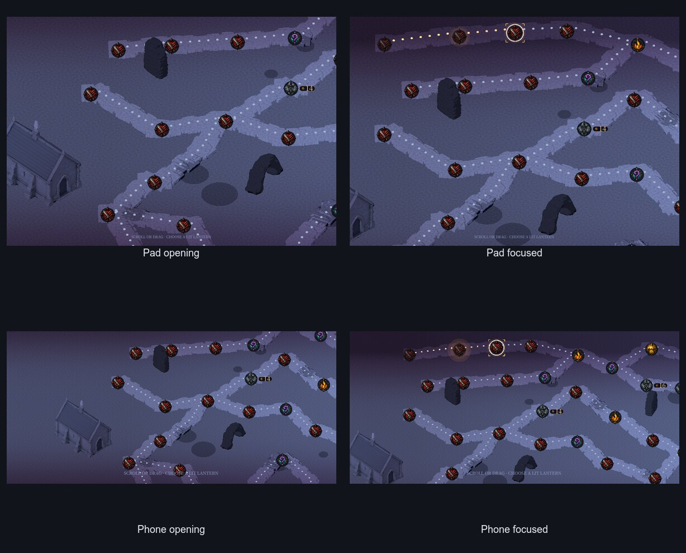
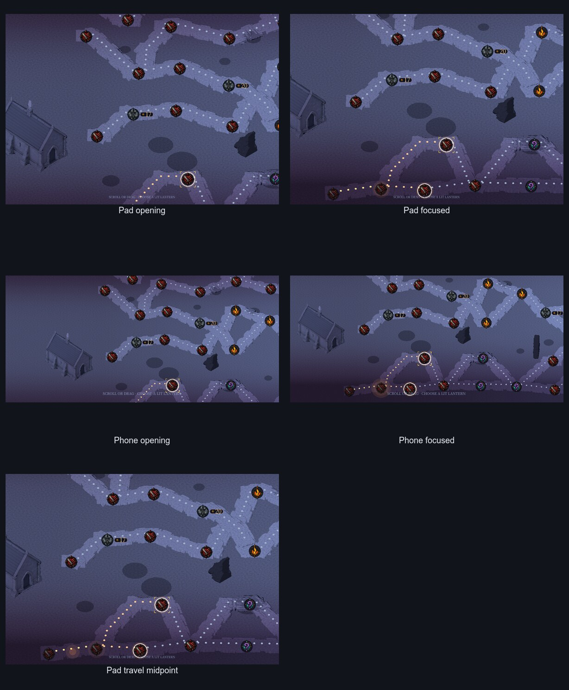
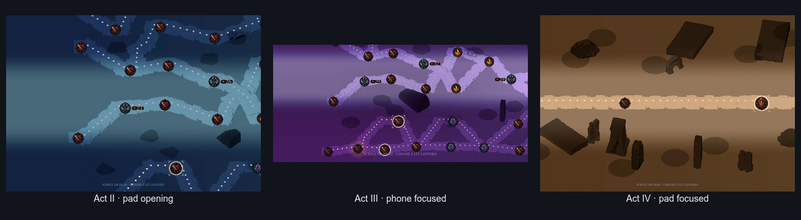

# Issue #475 production route review

This compact packet records the bounded production capture for the live
waylight and traveller switch. It does not claim commercial-grade approval;
it prepares the complete map for direct owner review under #461.

## Provenance

| Item | Value |
| --- | --- |
| Production capture head | `762c39aa71e2290856eb4ca6d64032fc3f083215` |
| Godot | `4.7.2.stable.official.ed1daf0bf` |
| Renderer | macOS Metal, Forward Mobile |
| Matrix | 5 compiler inputs, 12 frames |
| Runtime | 1,227.11 s real, 1,221.25 s user, 4.44 s system |
| Maximum RSS | 2,255,699,968 bytes |
| Asset manifest SHA-256 | `bd9f8566c8395113fd01a4be8a5b56ccf92e14218e83012ba547828c966dc0fd` |
| Capture manifest SHA-256 | `ed68e82542f3c968bc625ef7484d76d77596d80cedca9fffc7b034b355f5d650` |

The process exited 0. The manifest contains 12 of 12 expected frames, five
unique layout-input digests, positive `cold`, `open`, and `walked` counts in
all 11 ordinary frames, and one seed-717 midpoint at progress `0.5`. Every PNG
was checked against its recorded viewport dimensions.

## Direct review

| Question | Result |
| --- | --- |
| Can the player trace each branch? | Yes. The cold world-space beads continue along every visible road branch in both representative seeds and all four acts. |
| Is the open choice immediately visible? | Yes. The ember route leaves the current waystone and ends at the lit, focused destination, above the colder network. |
| Is walked history distinct but subordinate? | Yes. Gold history remains readable, while the current ember route and focused destination carry the active choice. |
| Does scenery correctly occlude world-space waylight? | Yes. Foreground silhouettes remove the beads they cover while the same route remains visible on either side; no no-depth-test recovery is present. |
| Does travel follow the visible road? | Yes. The seed-717 midpoint glow sits on the lower compiled bend. The manifest records the same edge and its exact sampled world point. |
| Is the 2D dotted overlay genuinely gone? | Yes. Route topology now changes with world perspective and occlusion. Only the small projected traveller glow remains; deterministic guards reject production `_draw_graph` and `edge_control` route authority. |

### Act I — seed 17634

SHA-256: `012fe1611a778968157f73fa64106ab4ffd97d1d0519083daa4423abfdb6d23e`

### Act I — seed 717 and travel midpoint

SHA-256: `1b6799a2489bc32de6ced14a3eb7a9d3da051bcfebd41772dbba2ec15d02a079`

### Acts II–IV — seed 717

SHA-256: `fa8d064bd93680a3f9d551e930e14eb418e2f23067c024bfccd9d2afaa495535`

These desktop captures prove production composition and depth behaviour. They
do not substitute for an iPhone or TestFlight performance protocol, which is
outside #475.
