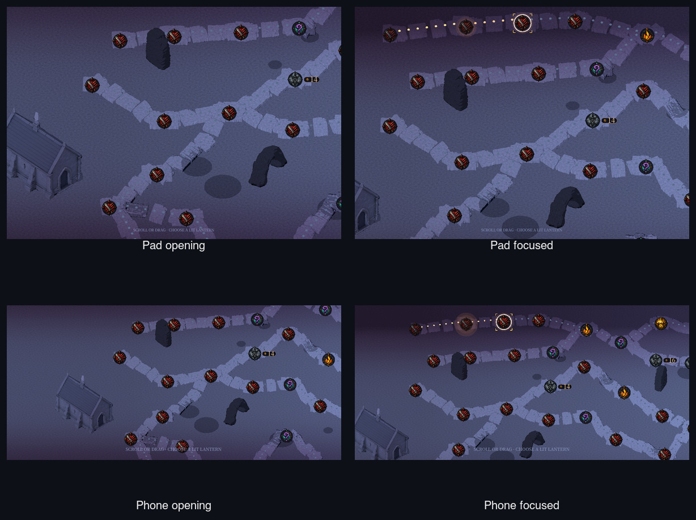
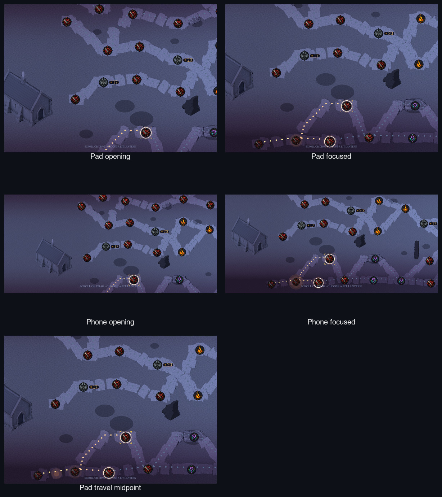
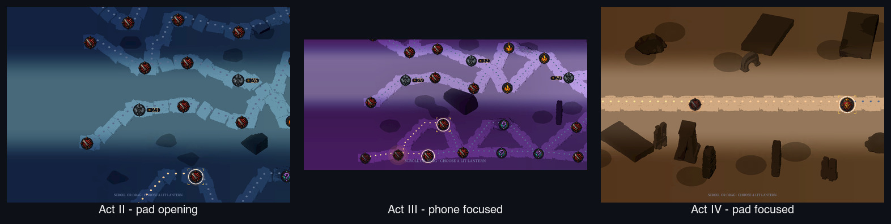

# Issue #529 map presentation review

This packet repeats the exact #475 production matrix for the narrow
presentation-only follow-up. It is evidence for Claude's design verdict and
Ash's ship gate. It does not claim commercial-grade approval or close #461.

## Provenance

| Item | Value |
| --- | --- |
| Before packet | `docs/reviews/475/` at `main@a130c7b0` |
| Production capture head | `38739e022388469003b744c760884e02f0c50803` |
| Godot | `4.7.2.stable.official.ed1daf0bf` |
| Renderer | macOS Metal, Forward Mobile |
| Matrix | The same 5 compiler inputs and 12 frames as #475 |
| Process result | Exit 0; 12 of 12 frames |
| Observed runtime | About 20 minutes 44 seconds at 99.1% CPU |
| Peak sampled RSS | 1,570,832 KB |
| Asset manifest SHA-256 | `bd9f8566c8395113fd01a4be8a5b56ccf92e14218e83012ba547828c966dc0fd` |
| Capture manifest SHA-256 | `d337ca8c77ca2358db210e11f4686af68abc3da300b0402f710160cbccd1aa44` |

The #475 and #529 frame records are deeply equal. All five input digests, all
five layout digests, node counts, route-state counts, camera poses, the travel
edge, and the midpoint world position remain exact. The only manifest-level
identity changes are the issue number and capture head. This proves that the
candidate does not change node or edge placement, route authority,
`MapLayoutResult`, or layout identity.

## Implementer assessment

The contact sheets answer the three open design findings without changing the
compiled graph.

| Finding | Captured result |
| --- | --- |
| Tangled branches | Improved. The unchanged branch network remains traceable, while separated early-act slabs stop adjacent roads from fusing into one continuous mass. |
| Procedural look | Improved. Acts I and II use fewer, narrower slabs with bounded alignment variation. Acts III and IV retain their existing paving profile. |
| Faint cold line | Improved. Deep blue-grey cold waylights remain subordinate to ember and gold, but separate clearly from the blue, purple, and sand road surfaces. |

These are implementation observations, not the final design verdict. Claude
remains design lead and Ash decides what may ship.

## Before and after

### Act I - seed 17634

| #475 before | #529 candidate |
| --- | --- |
|  |  |

Candidate contact-sheet SHA-256:
`25b505f643bca72f87814cdca2094bf5965275beafba35dcba3ad2e5bede612f`

### Act I - seed 717 and travel midpoint

| #475 before | #529 candidate |
| --- | --- |
|  |  |

Candidate contact-sheet SHA-256:
`61b622b584a424e7c11989b7378785e2402d820c0947c375103b5ef84173266d`

### Acts II-IV - seed 717

| #475 before | #529 candidate |
| --- | --- |
|  |  |

Candidate contact-sheet SHA-256:
`e9df3aab415d51e73af83e7f320feed06d4f7ac28c9560f784a0b226537f07de`

The committed sheets are compact review views. The manifest preserves the
complete frame matrix and its exact layout provenance; raw PNGs remain in the
local capture bundle for the duration of PR review.
