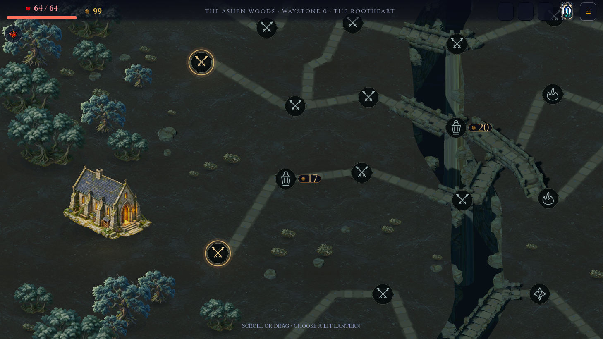
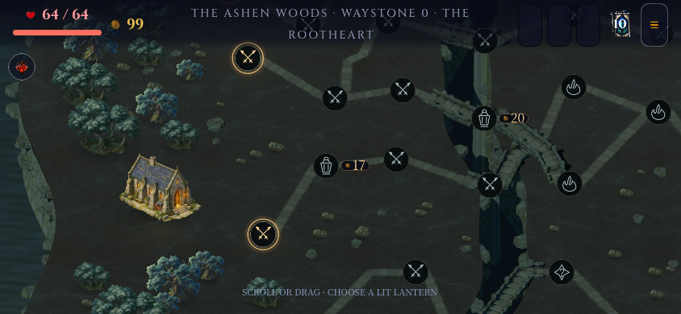
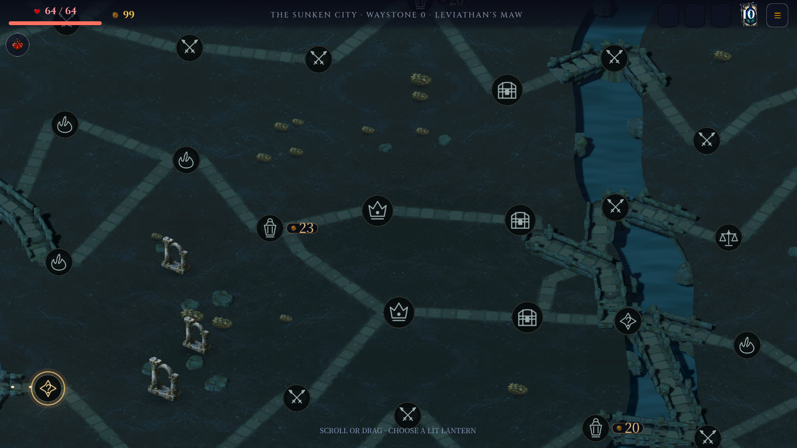
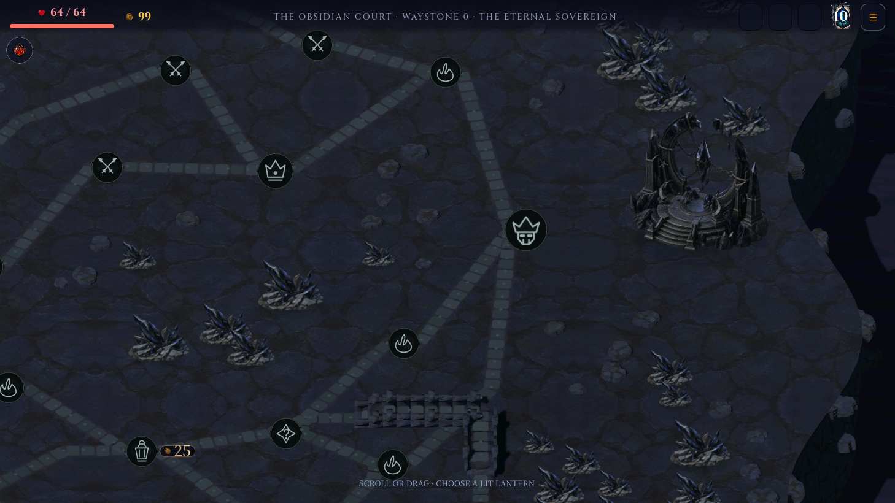
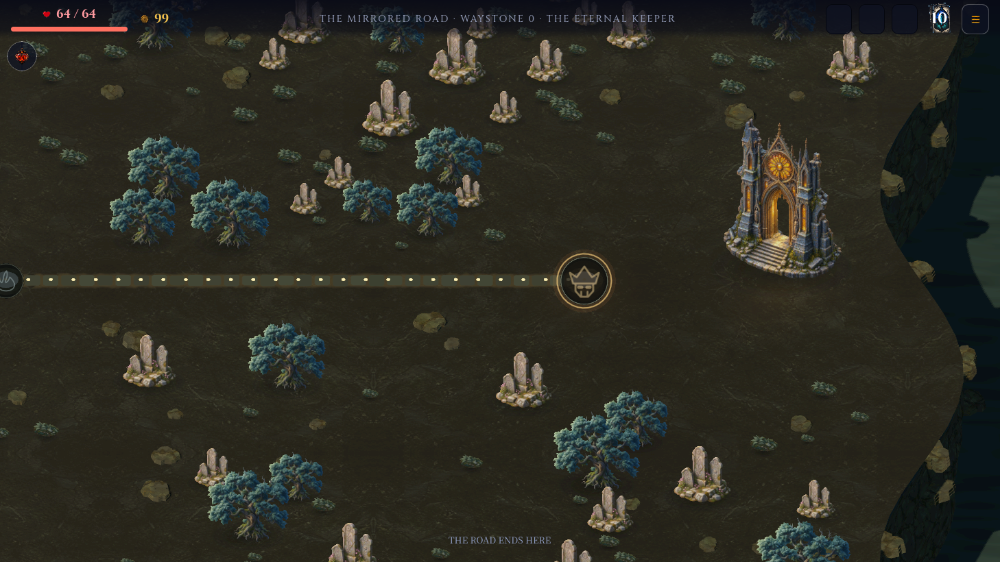

# Map reassembly

Owner instruction, 5 September 2026: rebuild the visualisation from scratch;
asset reuse is optional. Incremental polishing was explicitly rejected.

The superseded experiment is preserved on `jamesto/map-visual-renovation` at
`70c735c`. This delivery starts at `fb6c497c45ad5c283176e7d25c2bc861aae17033`
on `jamesto/map-reassembled`.

## Direction

A pilgrimage carved through an ancient, fractured world. Sculpted land shelves
and visible slate strata establish scale. Narrow pale paths and bridges join
architectural waypoints. Grouped groves and ruins frame clear route choices.
Moonlit blue shadows and restrained amber lanterns establish the visual
hierarchy. Surface detail must remain readable at actual phone and pad sizes.

`direction.png` is a newly generated art-direction study, not a screenshot
or proof of implemented gameplay. The implementation must earn the composition
in the running engine. It does not prescribe different game topology.

## Functional boundaries

The generator remains the source of node and route geometry. Game state, seeded
RNG, encounter IDs, save lineage, hit targets, input and accessibility remain
compatible. Build and inspect a coherent new scene before scaling to all acts.
No old visual implementation is automatically selected for reuse.

## Delivery

The new scene uses native concave land triangulation, exposed strata, worn
flagstones, bridged ravines and supporting piers. Thirteen new painted images
and one original Blender outcrop replace the previous renderer's asset set.
Landmarks and vegetation use depth-tested, camera-aligned 2.5D meshes; their
actual bounds feed the existing map compiler. Transparent cards, provenance,
file budgets and current-act residency are checked automatically.

The node and route coordinates remain the compiler's authority. All route
bends and elevations are retained. Scenery clears physical roads, hero zones
and projected touch/ink bounds across all shipping shapes and zoom stops.
Tree crowns can overlap one another while physical footprints remain disjoint.
The canonical Vigil reveal, saves, internal IDs and game RNG are unchanged.

The previous wedge/slab/dab implementation and its temporary capture tool are
removed. `tools/preview_map.gd` now captures the production screen and can
exercise viewport input. `tools/probe_map_seeds.gd` checks the new four-act
catalogue and repeatable cosmetic placement; it does not claim to compile maps.

## Validation scope

Native reference images cover phone, pad and desktop, all four acts, opening,
travelled, distant and terminal views. The shader keeps material scale in world
metres, uses mipmaps and mirrors tile edges without raster resampling. Inspection
caught and removed concave-bank triangle crossings; a regression case now checks
the complete triangle against the shoreline.

Deterministic checks cover complete generated geometry for seed 717 in all
four acts, 20 cosmetic seeds per act, native wheel/drag/keyboard arrival and
freeze, asset integrity and the standard production gates. Commands and final
results are recorded with the delivery PR. Desktop renderer timings are local
observations, not release-device qualification. The map compiler's pre-existing
fresh-layout cost is outside this presentation change; the preview cache is
excluded from production.

## Native captures

Captured from production `WorldMapScreen` and `RunHud` at code commit
`92888c39fbd9e0da786822c3e4e99955b78d7892`, seed 717, zoom stop 2.
The preview stages travelled map state without playing encounters; the HUD's
waystone counter therefore remains at its initial value in these staged views.
These are runtime images; the direction study above is a separate concept.

Act I opening, desktop 1458 × 820 and phone 844 × 390:

Act II middle, desktop, four prepared steps:

Act III terminus, desktop, seven prepared steps:

Act IV terminus, desktop, eight prepared steps:

